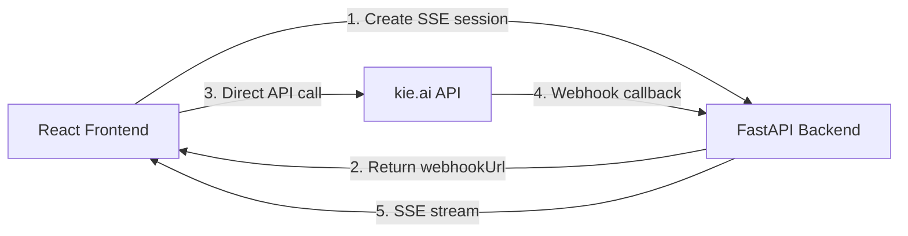

# Gen Canvas

> An open-source infinite canvas whiteboard with AI-powered image generation.

> An OSS alternative to [Mixboard](https://mixboard.app).

## Demo

[Watch the video demo](https://github.com/user-attachments/assets/b24def88-e92d-4851-b44f-238743ef94a0)


## Current Features

You can use the app by providing your own kie.ai
 API key (kie.ai offers a free tier). At the moment, only a single model is supported, but additional models from kie.ai can be integrated in the future with minimal effort.

Currently, you can guide a language model to generate prompts based on your input or create them manually, and then use those prompts to generate images. Once generated, you can resize and organize them freely on the canvas, and download the ones you prefer.

Editing images are not yet available, or saving the boards (as seen in Mixboard) is not supported at this time.


## Deployment

The app is currently deployed on [Render](https://gencanvas.onrender.com).

## Why Gen Canvas?

Current AI tools weren't built for **visual iteration workflows**.

- **Chat interfaces** (like ChatGPT or Google Gemini) are great for conversation—but break down when you need to **generate, compare, tweak, and evolve multiple images**. You lose context, versions, and spatial organization.

- Tools like Mixboard get much closer to the ideal workflow—but they come with limitations:
  - Locked into specific models
  - Limited control over prompting
  - Not extensible or hackable

Gen Canvas exists to fix that.


## Tech Stack

**Frontend:**

- React 19 + TypeScript

- Vite

- Tailwind CSS

- Zustand for state management

- Orval for type-safe API clients


**Backend:**

- FastAPI (Python 3.12)

- uvicorn as ASGI server

- sse-starlette for real-time updates

- httpx for async HTTP requests

- Groq (Llama 3.3 70B) for prompt enhancement — AI-powered prompt improvement to help you get better results


**DevOps:**

- Deployed on [Render](https://gencanvas.onrender.com)

- Docker support for containerized deployment


## Architecture




**How it works:**

1. Frontend creates an SSE session and receives a unique webhook URL

2. Frontend calls kie.ai directly with the user's API key (backend never sees it)

3. kie.ai sends webhooks to the backend when images are ready

4. Backend relays updates to the frontend via SSE


## Development Setup

### Prerequisites

- Node.js 20+

- Python 3.12+

- [pnpm](https://pnpm.io/installation)

- [uv](https://docs.astral.sh/uv/getting-started/installation/) (Python package manager)

- [cloudflared](https://developers.cloudflare.com/cloudflare-one/connections/connect-apps/install-and-setup/installation/) (for local webhooks)


### Why Cloudflare Tunnel?

The app uses kie.ai webhooks for real-time updates. Since webhooks need to reach your local server, you need a public URL. Cloudflare Tunnel provides this securely.

### Getting Started

**1. Install dependencies**

```bash
# Backend
cd server && uv sync

# Frontend
pnpm install
```

**2. Start the Cloudflare Tunnel**

Either run the `tunnel:cloudflared` VSCode task, or manually:

```bash
cloudflared tunnel --url http://localhost:8000
```

Copy the HTTPS URL it provides.

**3. Configure the backend**

Create `server/.env`:

```bash
GROQ_API_KEY=your-groq-api-key-here
SERVER_URL=https://your-tunnel-url.trycloudflare.com
CORS_ORIGINS=http://localhost:5173,https://your-tunnel-url.trycloudflare.com
```

**4. Start the services**

Either run the `dev:all` VSCode task, or manually:

```bash
# Backend (terminal 1)
cd server && uv run uvicorn main:app --reload

# Frontend (terminal 2)
pnpm dev
```

## Environment Variables

### Frontend (`.env`)

```bash

VITE_FASTAPI_URL=http://localhost:8000     # Backend URL (default: localhost:8000)
```

### Backend (`server/.env`)

```bash

GROQ_API_KEY=your-groq-api-key             # Required: GROQ API for AI-powered prompt enhancement

SERVER_URL=http://localhost:8000           # Server's public URL (for webhooks)

CORS_ORIGINS=http://localhost:5173         # Allowed CORS origins (comma-separated)
```

> **Note:** Groq provides a generous free tier for their Llama 3.3 model. Sign up at [groq.com](https://groq.com) to get your API key. The deployed version includes a key for testing, but for local development you'll need your own.


## Collaboration

Interested in contributing or collaborating? **DM me on [X/Twitter](https://x.com/KevinWeitgenant)**.

MIT License
