# InfiniteCanvas Component - Detailed Documentation

## Table of Contents

1. [Overview](#overview)
2. [Architecture](#architecture)
3. [Core Concepts](#core-concepts)
4. [Component Breakdown](#component-breakdown)
5. [Coordinate Systems](#coordinate-systems)
6. [Event Flow](#event-flow)
7. [Data Flow](#data-flow)
8. [Hooks Deep Dive](#hooks-deep-dive)
9. [State Management](#state-management)

---

## Overview

`InfiniteCanvas.tsx` is a React component that implements an **infinite canvas whiteboard** with the following features:

| Feature | Interaction |
|---------|-------------|
| **Draw** | Left mouse button drag |
| **Pan** | Right mouse button drag |
| **Zoom** | Mouse wheel scroll |
| **Persistent drawings** | Stored in Zustand state |

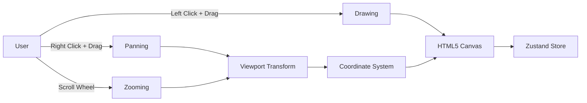

---

## Architecture

The component follows a **hook-based architecture** with clear separation of concerns:

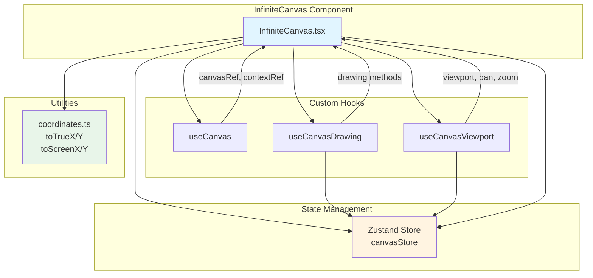

---

## Core Concepts

### 1. The Infinite Canvas Problem

An "infinite" canvas doesn't actually exist — we simulate it using:

1. **A viewport** that tracks where we're looking (offset X, offset Y, scale)
2. **Coordinate transformation** between screen space and "true" (infinite) space
3. **Persistent storage** of drawings in true coordinates

### 2. True vs Screen Coordinates

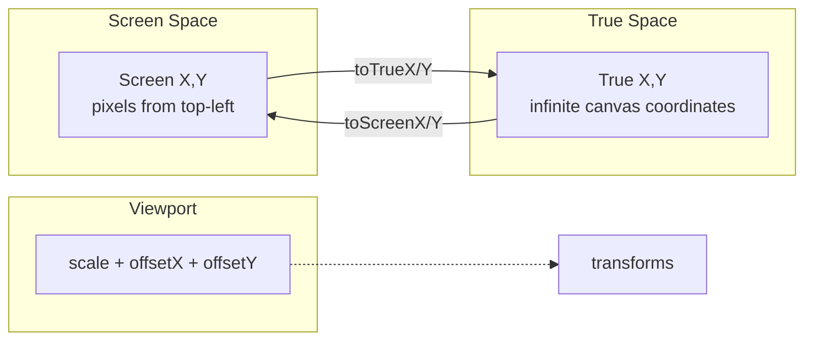

**Screen Coordinates**: Pixel positions on your monitor (e.g., `e.pageX`, `e.pageY`)

**True Coordinates**: Logical positions in the infinite canvas that remain consistent regardless of pan/zoom

---

## Component Breakdown

### Full Component Structure

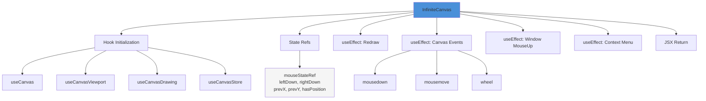

### Section-by-Section Analysis

#### 1. Imports (Lines 1-7)

```typescript
import { useRef, useEffect } from 'react';
import { useCanvas } from '../hooks/useCanvas';
import { useCanvasViewport } from '../hooks/useCanvasViewport';
import { useCanvasDrawing } from '../hooks/useCanvasDrawing';
import { useCanvasStore } from '../store/canvasStore';
import { toTrueX, toTrueY } from '../utils/coordinates';
```

| Import | Purpose |
|--------|---------|
| `useRef` | Mutable reference that doesn't trigger re-renders |
| `useEffect` | Side effects (event listeners, subscriptions) |
| `useCanvas` | Canvas element initialization and resizing |
| `useCanvasViewport` | Pan/zoom state management |
| `useCanvasDrawing` | Drawing operations and redraw logic |
| `useCanvasStore` | Zustand store for drawings and viewport |
| `toTrueX/Y` | Convert screen coordinates → true coordinates |

#### 2. Hook Initialization (Lines 10-14)

```typescript
const { canvasRef, contextRef } = useCanvas({ backgroundColor: '#fff' });
const { viewport, pan, zoom } = useCanvasViewport();
const drawing = useCanvasDrawing(contextRef, viewport);
const drawings = useCanvasStore((state) => state.drawings);
```

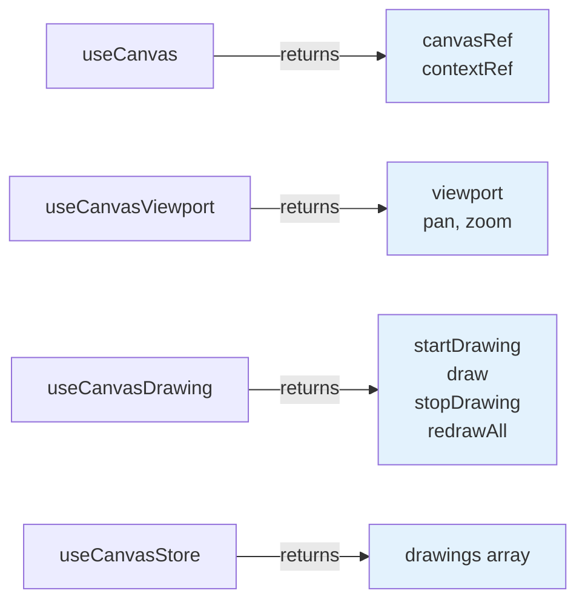

#### 3. Mouse State Ref (Lines 16-21)

```typescript
const mouseStateRef = useRef({
  leftDown: false,
  rightDown: false,
  prevX: 0,
  prevY: 0,
  hasPosition: false,
});
```

**Why a ref instead of state?**

Mouse events fire **very rapidly** (dozens of times per second during drag). Using React state would cause a re-render on every mouse move, killing performance. Refs allow us to track state without re-renders.

| Property | Purpose |
|----------|---------|
| `leftDown` | Is left mouse button pressed? (draw mode) |
| `rightDown` | Is right mouse button pressed? (pan mode) |
| `prevX, prevY` | Previous mouse position (for delta calculations) |
| `hasPosition` | Do we have a valid previous position? |

#### 4. Redraw Effect (Lines 23-26)

```typescript
useEffect(() => {
  drawing.redrawAll();
}, [drawings, drawing]);
```

Triggered whenever:
- A new drawing is added to the store
- The component mounts

**Note**: `viewport` is NOT in dependencies because the `drawing` hook's closure already captures it. When viewport changes, the `drawing` object is recreated (via `useCanvasDrawing`), triggering this effect.

#### 5. Canvas Events Effect (Lines 28-76)

This is the **core interaction handler** — combines mousedown, mousemove, and wheel.

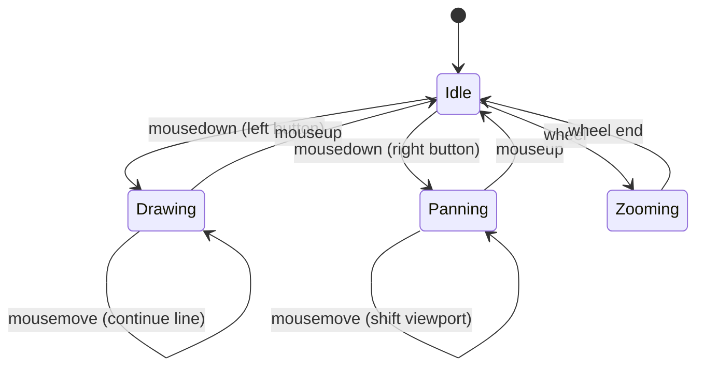

**Mouse Down Handler:**

```typescript
const handleMouseDown = (e: MouseEvent) => {
  e.preventDefault();

  const state = mouseStateRef.current;

  if (e.button === 0) {  // Left click
    state.leftDown = true;
    const trueX = toTrueX(e.pageX, viewport);
    const trueY = toTrueY(e.pageY, viewport);
    drawing.startDrawing(trueX, trueY);
  } else if (e.button === 2) {  // Right click
    state.rightDown = true;
  }

  state.prevX = e.pageX;
  state.prevY = e.pageY;
  state.hasPosition = true;
};
```

**Key points:**
- `e.button === 0` = left click, `e.button === 2` = right click
- Coordinates are **immediately converted to true coordinates** before storing
- `hasPosition` is set to `true` so mousemove can work

**Mouse Move Handler:**

```typescript
const handleMouseMove = (e: MouseEvent) => {
  const state = mouseStateRef.current;
  if (!state.hasPosition) return;  // Guard clause

  const trueX = toTrueX(e.pageX, viewport);
  const trueY = toTrueY(e.pageY, viewport);

  if (state.leftDown) {
    drawing.draw(trueX, trueY);  // Continue drawing
  }

  if (state.rightDown) {
    const deltaX = e.pageX - state.prevX;
    const deltaY = e.pageY - state.prevY;
    pan(deltaX, deltaY, viewport.scale);  // Pan the viewport
  }

  state.prevX = e.pageX;
  state.prevY = e.pageY;
};
```

**Wheel Handler:**

```typescript
const handleWheel = (e: WheelEvent) => {
  e.preventDefault();  // Prevent page scroll
  const scaleAmount = -e.deltaY / 500;
  zoom(scaleAmount, e.pageX, e.pageY, canvas.width, canvas.height);
};
```

- Negative `e.deltaY` means scrolling **up** (zoom in)
- `e.deltaY / 500` makes the zoom smooth and gradual

#### 6. Window MouseUp Effect (Lines 78-88)

```typescript
useEffect(() => {
  const handleMouseUp = () => {
    const state = mouseStateRef.current;
    state.leftDown = false;
    state.rightDown = false;
    drawing.stopDrawing();
  };

  window.addEventListener('mouseup', handleMouseUp);
  return () => window.removeEventListener('mouseup', handleMouseUp);
}, [drawing]);
```

**Why on `window` instead of `canvas`?**

If you drag outside the canvas and release the mouse, the canvas won't receive the `mouseup` event. Attaching to `window` ensures the drag ends regardless of where you release.

#### 7. Context Menu Effect (Lines 90-100)

```typescript
useEffect(() => {
  const handleContextMenu = (e: MouseEvent) => {
    e.preventDefault();
    return false;
  };

  document.addEventListener('contextmenu', handleContextMenu);
  return () => document.removeEventListener('contextmenu', handleContextMenu);
}, []);
```

Prevents the browser's right-click context menu from appearing, allowing right-drag to work for panning.

---

## Coordinate Systems

### The Math Behind Transformations

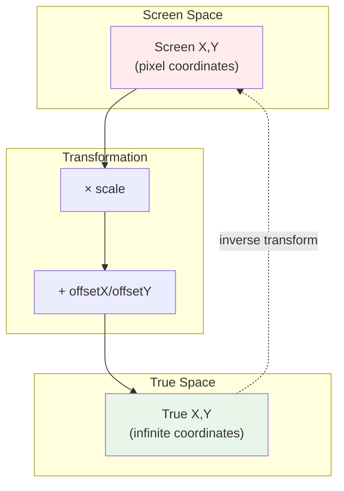

### Screen → True (Input)

When user clicks at screen position `(sx, sy)`:

```typescript
trueX = (sx / scale) - offsetX
trueY = (sy / scale) - offsetY
```

**Why this formula?**
1. Divide by scale to "undo" zoom
2. Subtract offset to "undo" pan

### True → Screen (Rendering)

When rendering a point at true position `(tx, ty)`:

```typescript
screenX = (tx + offsetX) × scale
screenY = (ty + offsetY) × scale
```

**Why this formula?**
1. Add offset to apply pan
2. Multiply by scale to apply zoom

### Visual Example

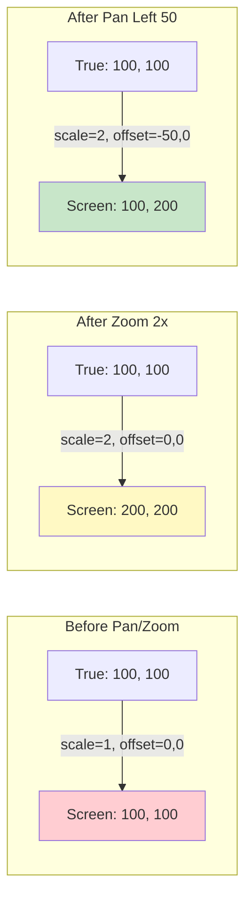

---

## Event Flow

### Complete Mouse Interaction Flow

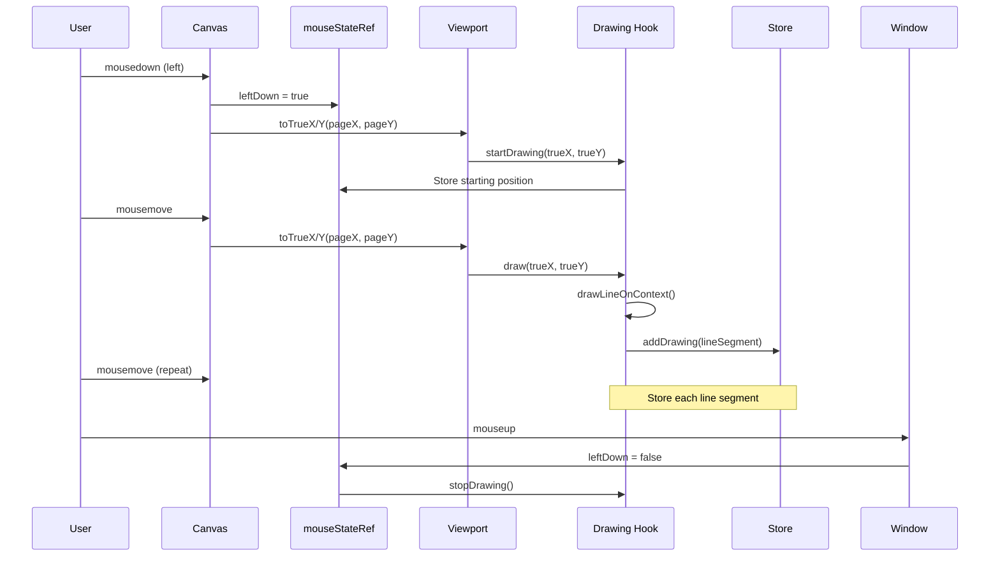

### Pan Interaction Flow

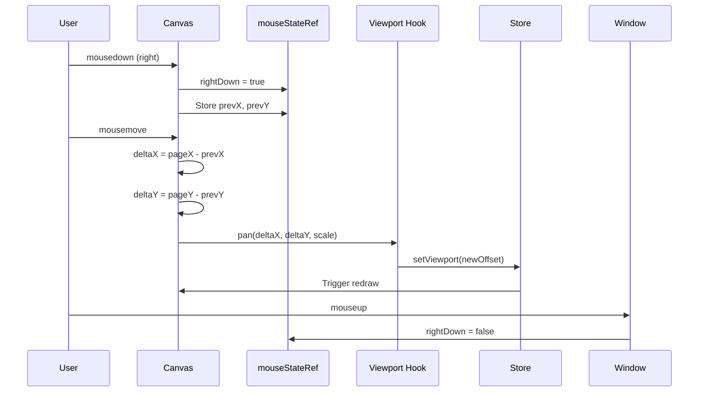

### Zoom Interaction Flow

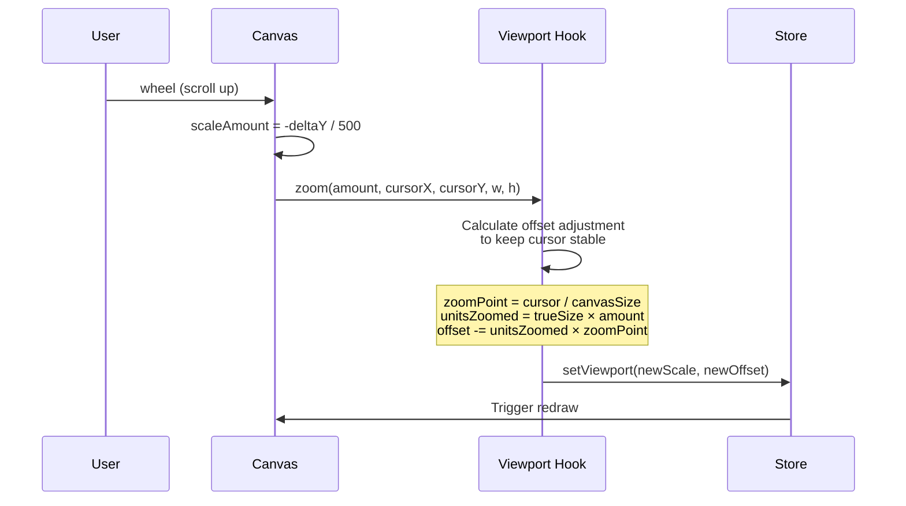

---

## Data Flow

### State Update Propagation

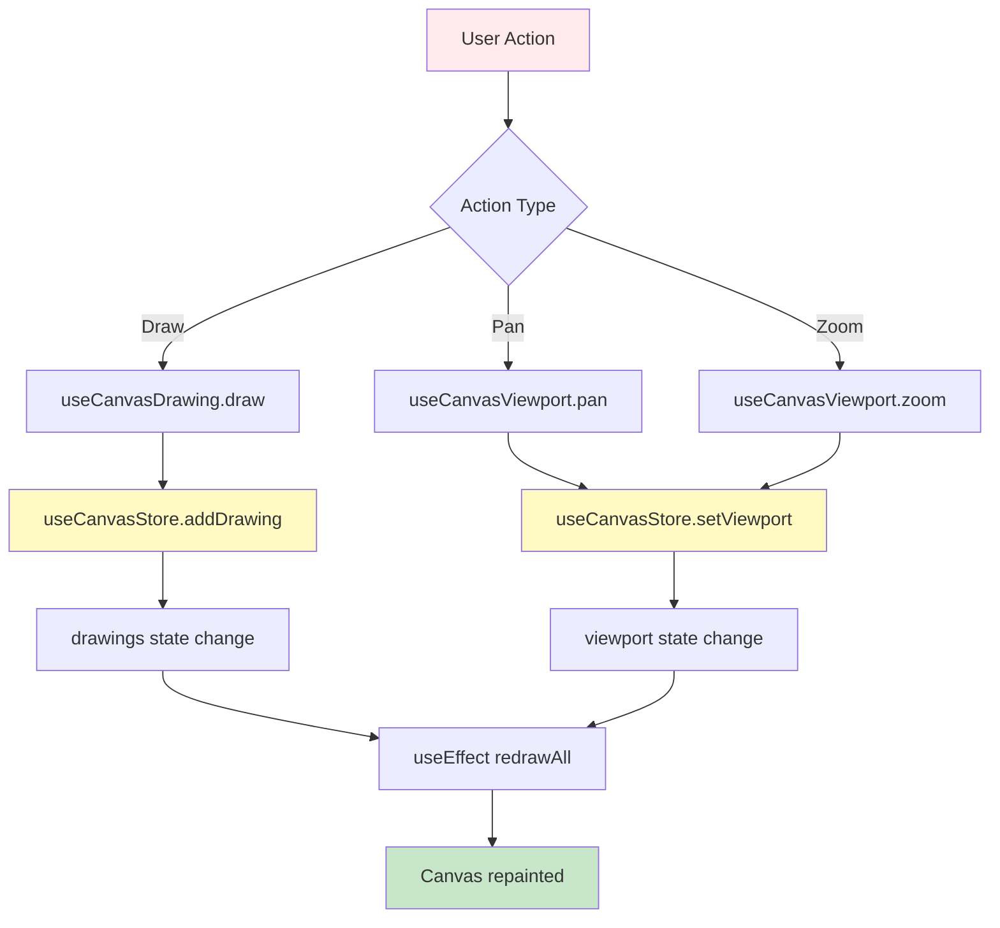

### Drawing Lifecycle

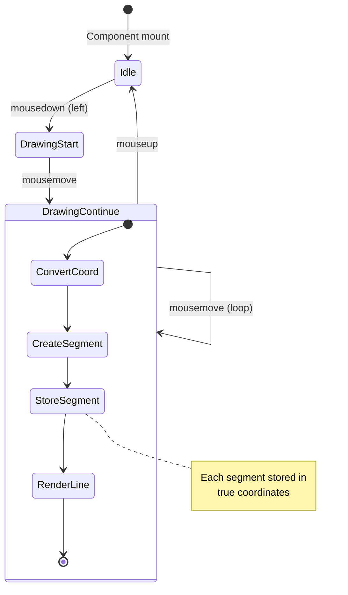

---

## Hooks Deep Dive

### useCanvas Hook

**Purpose**: Canvas element initialization and lifecycle management

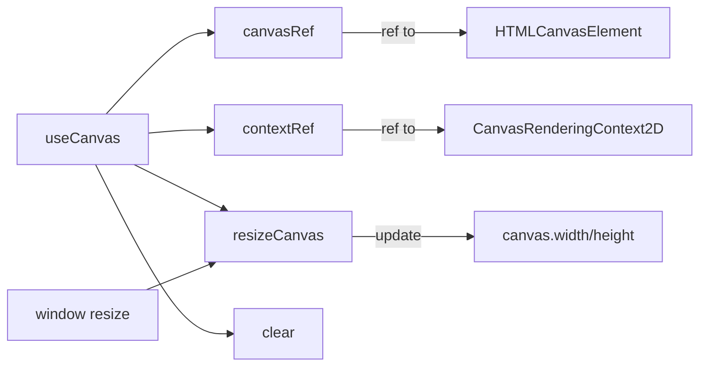

**Key responsibilities:**
1. Create refs for canvas and context
2. Initialize canvas size to window size
3. Handle window resize events
4. Provide `clear()` function to reset canvas

**Returns:**
```typescript
{
  canvasRef: RefObject<HTMLCanvasElement>,
  contextRef: RefObject<CanvasRenderingContext2D>,
  clear: () => void,
  resizeCanvas: () => void
}
```

---

### useCanvasViewport Hook

**Purpose**: Manage pan and zoom state

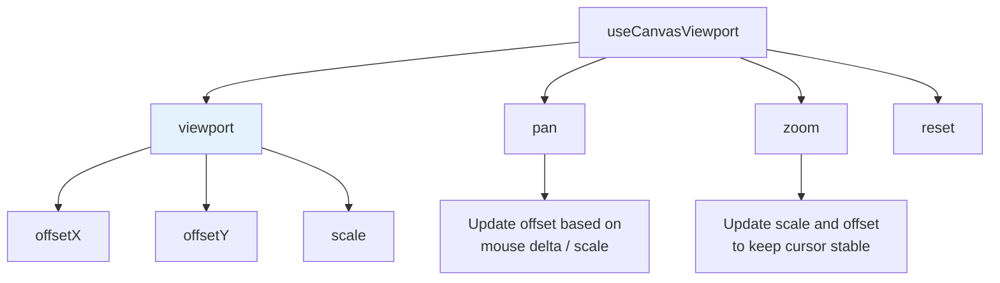

**Pan Formula:**
```typescript
newOffsetX = oldOffsetX + (deltaX / currentScale)
newOffsetY = oldOffsetY + (deltaY / currentScale)
```
Dividing by scale ensures panning speed feels consistent regardless of zoom level.

**Zoom Formula:**
```typescript
newScale = oldScale × (1 + scaleAmount)

// Adjust offset to keep cursor position stable
distX = cursorX / canvasWidth  // Cursor as ratio (0-1)
distY = cursorY / canvasHeight

unitsZoomedX = trueWidth(canvasWidth, oldScale) × scaleAmount
unitsZoomedY = trueHeight(canvasHeight, oldScale) × scaleAmount

newOffsetX = oldOffsetX - (unitsZoomedX × distX)
newOffsetY = oldOffsetY - (unitsZoomedY × distY)
```

---

### useCanvasDrawing Hook

**Purpose**: Handle all drawing operations

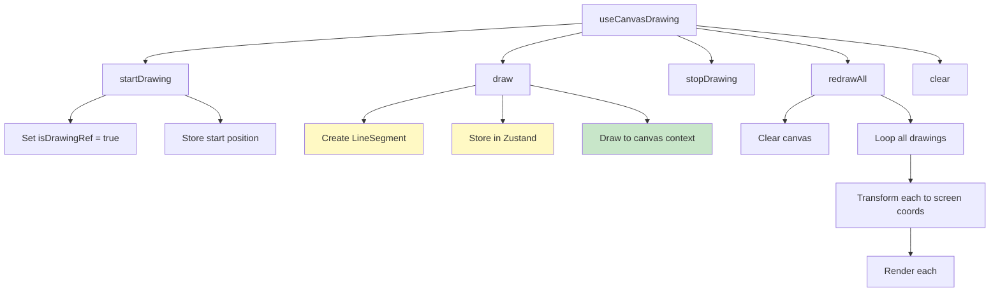

**Internal State:**
```typescript
isDrawingRef: boolean       // Currently in a drawing stroke?
prevPositionRef: {x, y}     // Last true coordinate drawn
```

**Drawing Flow:**
1. `draw()` is called with new true coordinates
2. Creates a `LineSegment` from prev position to new position
3. Stores segment in Zustand (persistence)
4. Immediately renders to canvas (immediate feedback)
5. Updates `prevPositionRef` for next segment

---

## State Management

### Zustand Store Structure

```mermaid
graph TB
    subgraph "CanvasStore"
        A[State]
        B[Actions]
    end

    A --> A1[drawings: LineSegment[]]
    A --> A2[viewport: Viewport]

    B --> B1[addDrawing]
    B --> B2[setDrawings]
    B --> B3[setViewport]
    B --> B4[clear]

    style A fill:#e8f5e9
    style B fill:#fff3e0
```

**State Interface:**
```typescript
interface CanvasState {
  drawings: LineSegment[];  // All drawn lines
  viewport: Viewport;        // Current pan/zoom state
}
```

**Actions Interface:**
```typescript
interface CanvasActions {
  addDrawing: (drawing: LineSegment) => void;
  setDrawings: (drawings: LineSegment[]) => void;
  setViewport: (viewport: Viewport) => void;
  clear: () => void;
}
```

### Why Zustand?

| Feature | Zustand | React useState | Context API |
|---------|---------|----------------|-------------|
| No provider needed | ✅ | ❌ | ❌ |
| Minimal boilerplate | ✅ | ✅ | ❌ |
| Selector subscriptions | ✅ | ✅ | ❌ |
| DevTools integration | ✅ | ❌ | ✅ |
| Easy to test | ✅ | ✅ | Moderate |

Zustand is ideal here because:
- Canvas state doesn't need React context (no props drilling)
- Selective subscriptions prevent unnecessary re-renders
- Simple API for actions

---

## Summary

### Key Takeaways

1. **Refs over State for High-Frequency Updates**: Mouse state uses refs to avoid re-renders
2. **Coordinate Transformation is Central**: True coordinates enable infinite canvas illusion
3. **Event Consolidation**: Related events grouped in single effects for cleaner code
4. **Separation of Concerns**: Each hook has a single responsibility
5. **Persistence via Store**: Drawings stored centrally, enabling redraw on viewport changes

### Component Data Flow Summary

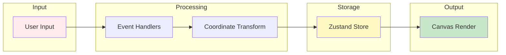

---

## File Reference

| File | Purpose |
|------|---------|
| `src/components/InfiniteCanvas.tsx` | Main component |
| `src/hooks/useCanvas.ts` | Canvas initialization |
| `src/hooks/useCanvasViewport.ts` | Pan/zoom logic |
| `src/hooks/useCanvasDrawing.ts` | Drawing operations |
| `src/store/canvasStore.ts` | Zustand state |
| `src/utils/coordinates.ts` | Coordinate transforms |
| `src/types/canvas.ts` | TypeScript types |

---

*Documentation generated for InfiniteCanvas React Whiteboard*
