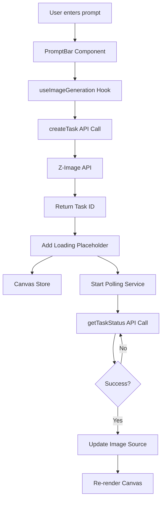
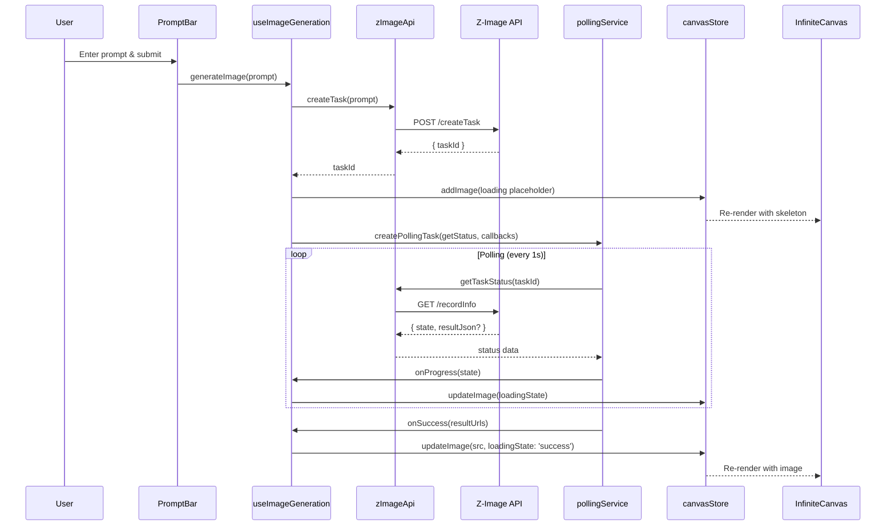
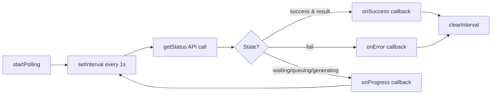
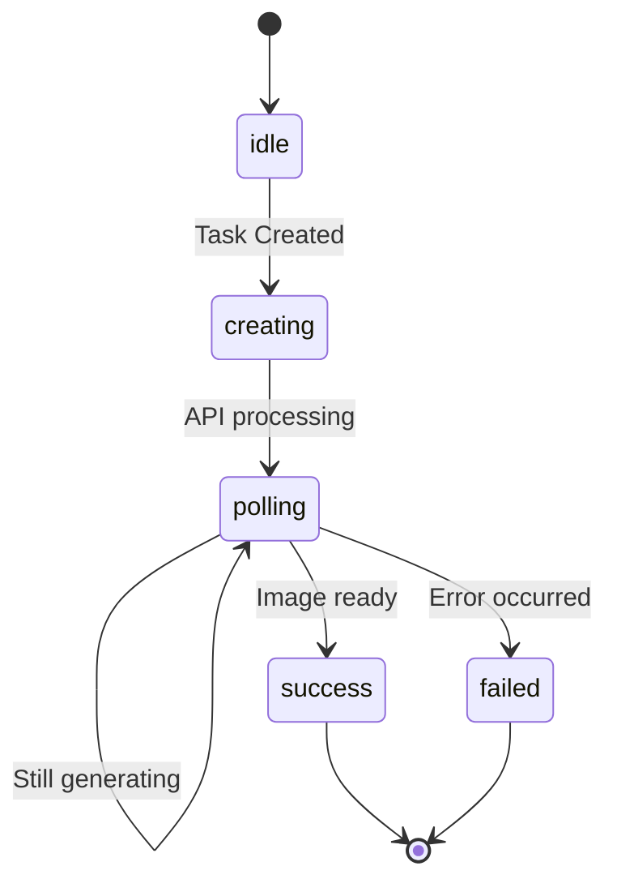
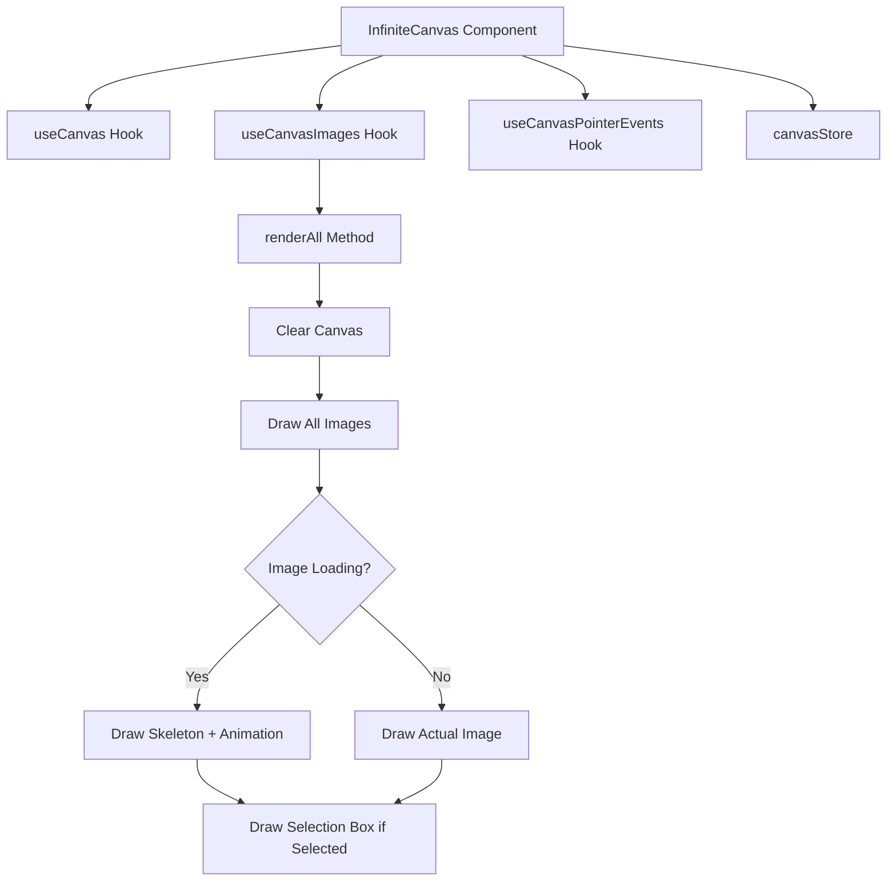
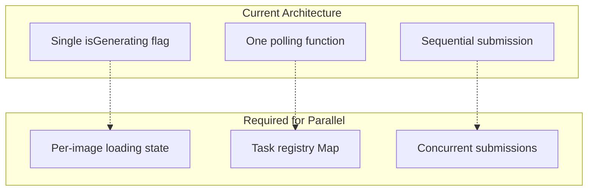
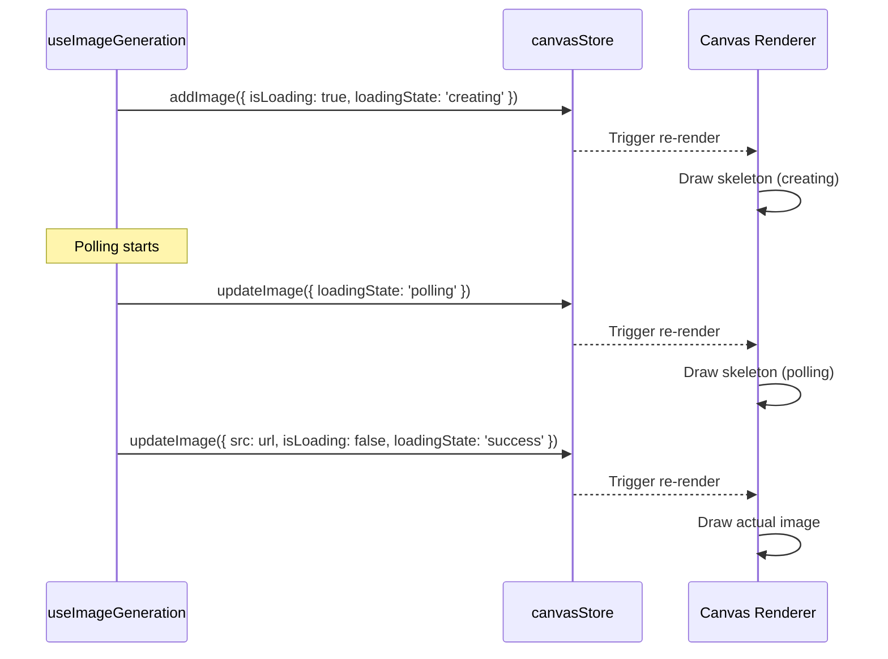

# API Integration & Rendering Architecture

This document explains how the Z-Image AI generation API integrates with the infinite canvas, including the data flow, polling mechanism, and rendering pipeline.

## Table of Contents

- [Overview](#overview)
- [Architecture](#architecture)
- [API Flow](#api-flow)
- [Polling Mechanism](#polling-mechanism)
- [Canvas Rendering](#canvas-rendering)
- [Parallel Generation](#parallel-generation)
- [State Management](#state-management)

## Overview

The application uses the Z-Image API (via Kie.ai) to generate images from text prompts. The integration follows a request-polling-render pattern:

1. User submits a prompt via the PromptBar
2. API creates a task and returns a task ID
3. Client polls the API for task status
4. On completion, the image is rendered on the canvas



## Architecture

### Core Components

| Component | File | Responsibility |
|-----------|------|-----------------|
| PromptBar | `src/components/PromptBar.tsx` | UI for prompt input and submission |
| useImageGeneration | `src/hooks/useImageGeneration.ts` | Orchestrates generation flow |
| zImageApi | `src/services/zImageApi.ts` | Direct API calls to Z-Image |
| pollingService | `src/services/pollingService.ts` | Generic polling utility |
| canvasStore | `src/store/canvasStore.ts` | Centralized state management |
| InfiniteCanvas | `src/components/InfiniteCanvas.tsx` | Canvas rendering container |

### Data Flow Diagram



## API Flow

### 1. Task Creation

The `createTask` function initiates a new image generation:

```typescript
// src/services/zImageApi.ts
export async function createTask(prompt: string): Promise<string> {
  const requestBody: CreateTaskRequest = {
    model: MODEL_Z_IMAGE,
    input: {
      prompt,
      aspect_ratio: DEFAULT_ASPECT_RATIO,
      nsfw_checker: true,
    },
  };

  const data = await apiCall<CreateTaskResponse['data']>(
    `${API_BASE_URL}${ENDPOINTS.CREATE_TASK}`,
    { method: 'POST', headers: { 'Authorization': `Bearer ${API_KEY}` }, body: JSON.stringify(requestBody) },
    'Failed to create task'
  );

  return data.taskId;
}
```

**Request/Response:**

```
POST https://api.kie.ai/api/v1/jobs/createTask
Authorization: Bearer <API_KEY>

Request Body:
{
  "model": "z-image",
  "input": {
    "prompt": "a beautiful sunset",
    "aspect_ratio": "1:1",
    "nsfw_checker": true
  }
}

Response:
{
  "code": 200,
  "msg": "success",
  "data": {
    "taskId": "task_12345"
  }
}
```

### 2. Task Status Polling

The `getTaskStatus` function checks the status of a generation task:

```typescript
// src/services/zImageApi.ts
export async function getTaskStatus(
  taskId: string
): Promise<{ state: TaskState; resultUrls?: string[] }> {
  const searchParams = new URLSearchParams({ taskId });

  const data = await apiCall<TaskStatusData>(
    `${API_BASE_URL}${ENDPOINTS.TASK_STATUS}?${searchParams}`,
    { method: 'GET', headers: { 'Authorization': `Bearer ${API_KEY}` } },
    'Failed to get task status'
  );

  const { state, resultJson } = data;

  if (state === 'success' && resultJson) {
    const result: TaskResult = JSON.parse(resultJson);
    return { state, resultUrls: result.resultUrls };
  }

  return { state };
}
```

**Task States:**

| State | Description |
|-------|-------------|
| `waiting` | Task is queued and waiting to start |
| `queuing` | Task is in the queue |
| `generating` | Image is being generated |
| `success` | Generation completed successfully |
| `fail` | Generation failed |

## Polling Mechanism

The polling service provides a generic way to poll for async operation results:



### Polling Configuration

| Setting | Value | Location |
|---------|-------|----------|
| Interval | 1000ms (1 second) | `src/constants/imageGeneration.ts` |
| Max Duration | Unlimited (no timeout) | N/A |
| Retry Logic | None (fails immediately on error) | N/A |

### Loading State Transitions



### Cleanup

The polling service returns a cleanup function that clears the interval:

```typescript
const stopPolling = createPollingTask({ ... });

// Later, to stop polling
stopPolling(); // Clears the interval
```

**Note:** Currently, the cleanup function is stored on `window._stopPolling` which is a temporary solution and should be replaced with proper state management.

## Canvas Rendering

### Rendering Pipeline



### Loading Placeholder Rendering

While an image is being generated, a skeleton with animated text is drawn:

```typescript
// From useCanvasImages.ts (conceptual)
if (image.isLoading) {
  // Draw skeleton box
  ctx.fillStyle = '#f0f0f0';
  ctx.fillRect(x, y, width, height);

  // Draw animated "Generating..." text
  const dots = '.'.repeat(Math.floor(Date.now() / 500) % 4);
  ctx.fillText(`Generating${dots}`, x + width/2, y + height/2);
}
```

The canvas re-renders every 500ms while there are loading images to create the animation effect:

```typescript
// InfiniteCanvas.tsx
const hasLoadingImages = imageList.some(img => img.isLoading);
useEffect(() => {
  if (!hasLoadingImages) return;
  const interval = setInterval(render, 500);
  return () => clearInterval(interval);
}, [hasLoadingImages, render]);
```

## Parallel Generation

### Can we generate images in parallel?

**Short Answer:** No, not with the current implementation.

### Current Limitations

The current architecture has several constraints that prevent parallel generation:

#### 1. Single Generation State

```typescript
// PromptBar.tsx
const [isGenerating, setIsGenerating] = useState(false);

const canGenerate = prompt.trim() && !isGenerating && selectedModels.includes(MODEL_Z_IMAGE);
```

The `isGenerating` flag blocks any new submissions while a generation is in progress.

#### 2. No Task Registry

```typescript
// useImageGeneration.ts
// Cleanup function is overwritten on each new generation
(window as unknown as { _stopPolling?: () => void })._stopPolling = stopPolling;
```

Only one polling function is tracked, so starting a new generation would lose the reference to the previous one.

#### 3. Sequential UI Flow

```typescript
// PromptBar.tsx
setIsGenerating(true);
try {
  await generateImage(prompt);
  setPrompt("");
} finally {
  setIsGenerating(false);
}
```

The UI waits for each generation to complete before allowing the next.

### What Would Need to Change?

To support parallel image generation, the following changes would be needed:



#### Required Changes:

1. **Remove global `isGenerating` flag** - Each image tracks its own loading state
2. **Implement a Task Registry** - Track multiple active polling operations
3. **Update PromptBar** - Allow multiple concurrent submissions
4. **Add task cleanup on unmount** - Prevent memory leaks

#### Example Task Registry Pattern:

```typescript
// Proposed enhancement
interface TaskRegistry {
  tasks: Map<string, {
    imageId: string;
    taskId: string;
    stopPolling: () => void;
    startTime: number;
  }>;
  add(imageId: string, taskId: string, stopPolling: () => void): void;
  remove(imageId: string): void;
  get(imageId: string): Task | undefined;
  clearAll(): void;
}
```

### Pros and Cons of Parallel Generation

| Pros | Cons |
|------|------|
| Faster batch generation | API rate limiting may apply |
| Better UX for multiple images | More complex state management |
| Utilizes asynchronous nature | Higher memory usage |
| Can cancel individual tasks | Harder to track progress |

### Current Recommendation

For the current implementation, **parallel generation is not supported** and attempting to queue multiple generations quickly will result in:

1. The first generation proceeding normally
2. Subsequent submissions being blocked by the UI
3. If forced, only the last task's polling function would be retained

## State Management

### Canvas Store (Zustand)

The canvas store manages all application state:

```typescript
interface CanvasState {
  images: ImageElement[];           // All images on canvas
  selectedImageId: string | null;   // Single selection
  selectedImageIds: string[];       // Multi-selection
  viewport: Viewport;               // Pan/zoom state
  currentTool: Tool;                // 'pan' or 'selection'
  undoStack: ImageElement[][];      // Undo history
}
```

### Image Element Structure

```typescript
interface ImageElement {
  id: string;                       // Unique identifier
  type: 'image';                    // Type discriminator
  src: string;                      // Image URL (empty when loading)
  x: number;                        // Canvas X position
  y: number;                        // Canvas Y position
  width: number;                    // Display width
  height: number;                   // Display height
  isLoading?: boolean;              // Loading state flag
  loadingState?: 'idle' | 'creating' | 'polling' | 'downloading' | 'success' | 'failed';
}
```

### State Updates During Generation



## Performance Considerations

### Current Performance Characteristics

1. **Polling overhead**: 1 request per second per generation
2. **Canvas re-renders**: Every 500ms when images are loading
3. **Image loading**: Uses browser's native `Image.onload`
4. **Memory**: All images kept in memory (no virtualization)

### Optimization Opportunities

| Area | Current | Potential Improvement |
|------|---------|----------------------|
| Polling interval | Fixed 1s | Exponential backoff |
| Loading animation | 500ms render loop | CSS-based loading indicator |
| Image cache | Browser default | Service worker + IndexedDB |
| Viewport rendering | All images | Virtual rendering for off-screen images |

## Error Handling

### Current Error Handling

```typescript
// useImageGeneration.ts
try {
  const taskId = await createTask(prompt);
  // ... rest of flow
} catch (error) {
  console.error('Failed to generate image:', error);
  return null;
}
```

### Error States

| Error Type | Current Behavior |
|------------|------------------|
| API call failure | Logs to console, returns null |
| Polling failure | Stops polling, no user feedback |
| Parse error (resultJson) | Logs error, continues without image |
| Network timeout | Uses default fetch timeout |

### Recommended Improvements

1. Add user-facing error notifications
2. Implement retry logic with exponential backoff
3. Add timeout for long-running generations
4. Track failed generations for retry

## API Configuration

### Environment Variables

```typescript
// src/config/api.ts
const API_BASE_URL = 'https://api.kie.ai';
const API_KEY = import.meta.env.VITE_KIE_AI_API_KEY;
```

Required `.env` variable:
```
VITE_KIE_AI_API_KEY=your_api_key_here
```

### Constants

```typescript
// src/constants/imageGeneration.ts
export const DEFAULT_IMAGE_SIZE = 512;      // Placeholder size (px)
export const POLLING_INTERVAL = 1000;        // Poll check interval (ms)
export const MODEL_Z_IMAGE = 'z-image';      // Model identifier
export const DEFAULT_ASPECT_RATIO = '1:1';   // Default aspect ratio
```

## Summary

The current implementation provides a solid foundation for AI image generation with:

- ✅ Clean separation of concerns
- ✅ Type-safe API integration
- ✅ Generic polling utility
- ✅ Smooth loading animations
- ⚠️ Single-generation limitation
- ⚠️ Basic error handling

For production use with parallel generation capabilities, the task registry and state management would need to be enhanced as described in the [Parallel Generation](#parallel-generation) section.
