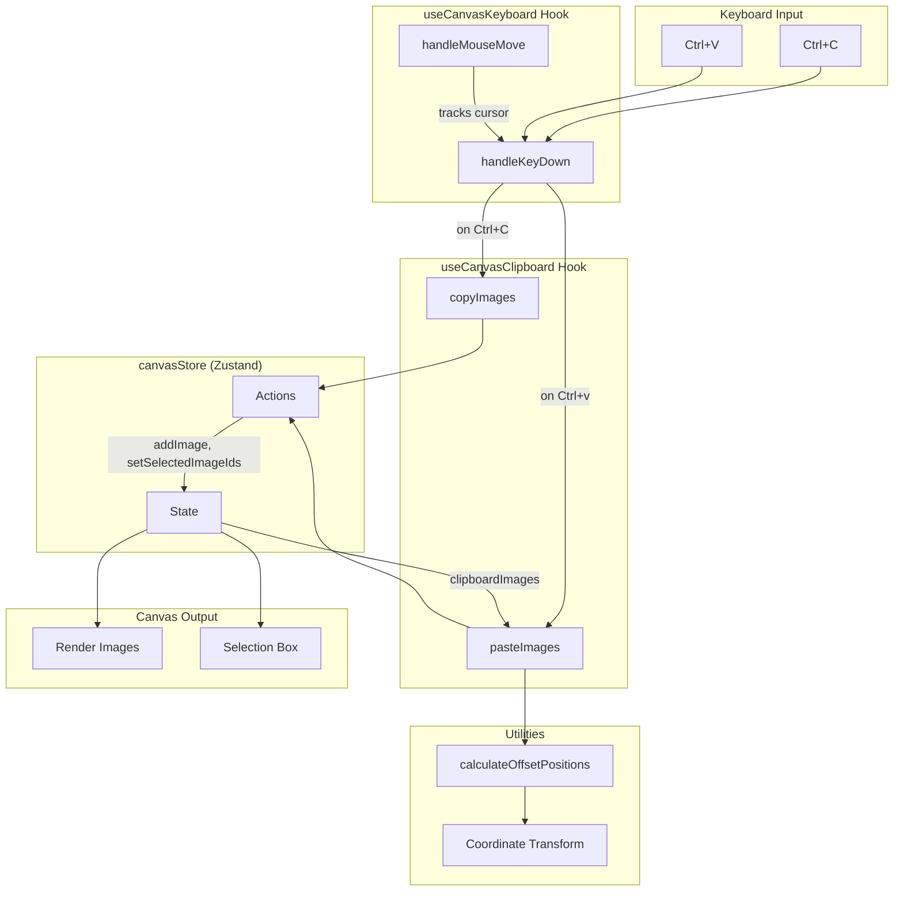
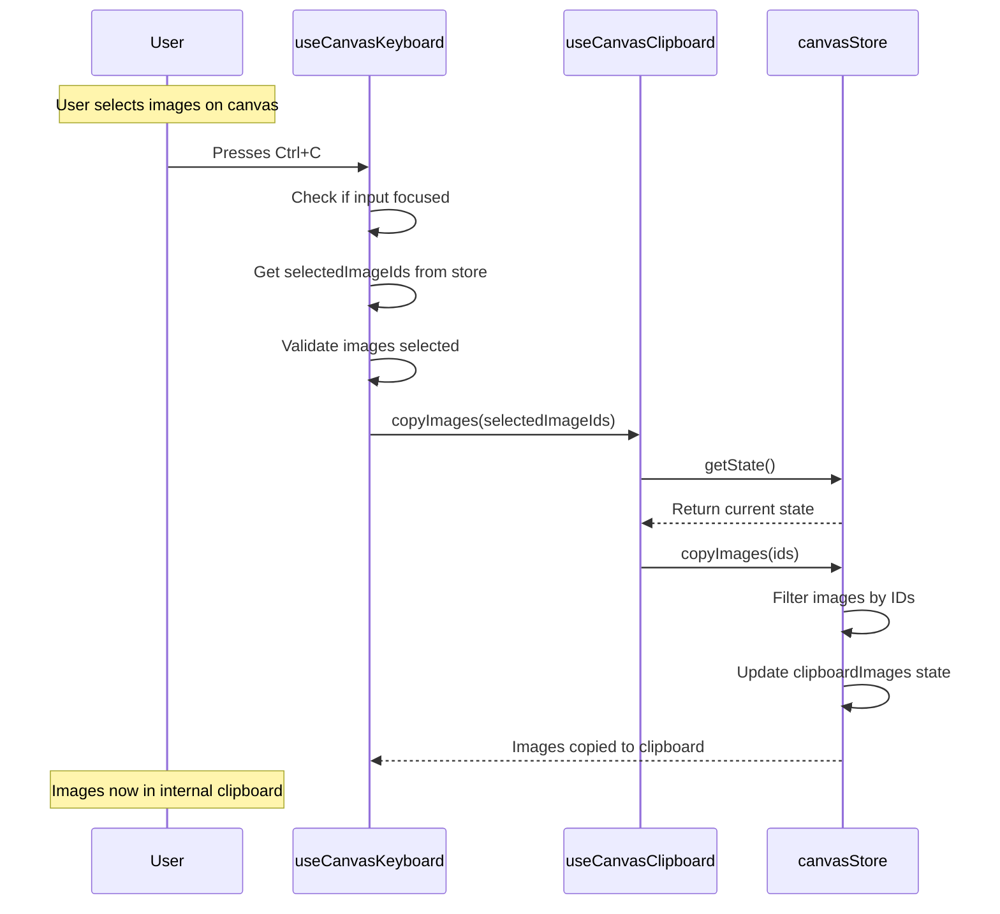
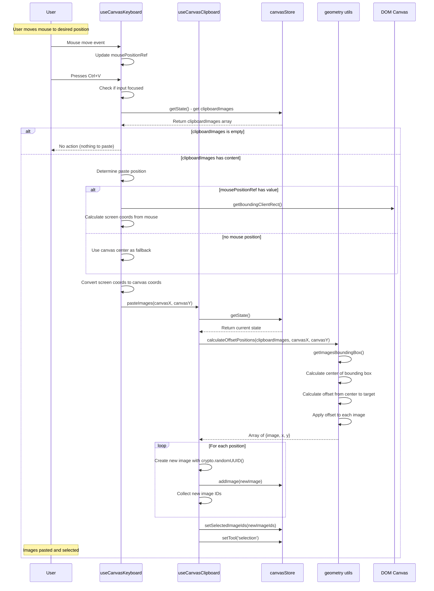
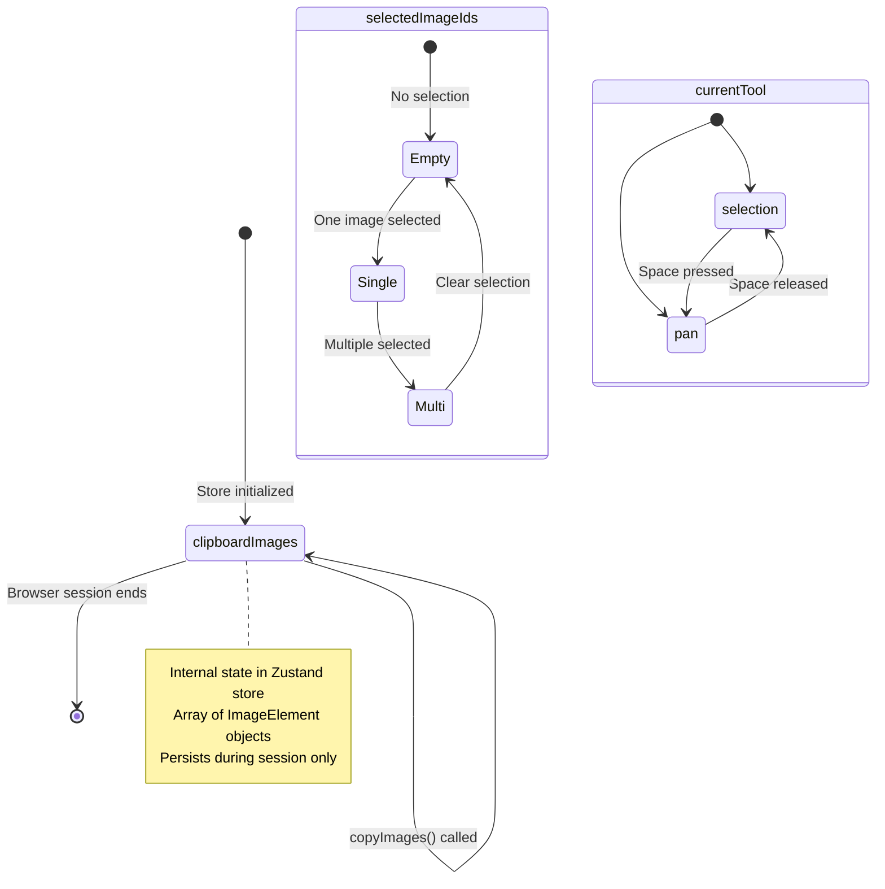

# Clipboard Functionality Documentation

## Overview

The clipboard functionality allows users to copy and paste images on the infinite canvas using standard keyboard shortcuts (`Ctrl+C` for copy, `Ctrl+V` for paste). The implementation uses an internal clipboard state that stores copied images and preserves their relative positions when pasting.

## Features

- **Copy (Ctrl+C)**: Copy selected images to the internal clipboard
- **Paste (Ctrl+V)**: Paste images at the mouse cursor position or canvas center
- **Multi-image support**: Copy and paste multiple images while preserving their relative positions
- **Automatic selection**: Pasted images are automatically selected after pasting
- **Tool switching**: Automatically switches to selection tool after pasting

## Architecture

### Data Flow Diagram



**Explanation**: This diagram shows how data flows through the system when you copy or paste. When you press Ctrl+C or Ctrl+V, the keyboard hook captures the input and routes it to the clipboard hook. The clipboard hook then either copies images to the store or retrieves them, using geometry utilities to calculate positions. Finally, the store updates trigger re-rendering of images and selection boxes on the canvas.

### Sequence Diagram: Copy Operation



**Explanation**: This diagram illustrates the step-by-step process of copying images. When you press Ctrl+C, the keyboard handler first checks that you're not typing in an input field. It then retrieves the IDs of selected images from the store and validates that images are actually selected. The clipboard hook takes these IDs, filters the images from the store, and saves them to the internal clipboard state. The images are now stored in memory and ready to be pasted.

### Sequence Diagram: Paste Operation



### State Management



## Implementation Details

### Files Modified

1. **`src/store/canvasStore.ts`**
   - Added `clipboardImages: ImageElement[]` to state
   - Added `copyImages(ids: string[])` action
   - Stores copies of images with all their properties

2. **`src/hooks/useCanvasClipboard.ts`** (new file)
   - `copyImages(ids)`: Copies images to internal clipboard
   - `pasteImages(canvasX, canvasY)`: Pastes images at position with offset calculation

3. **`src/hooks/useCanvasKeyboard.ts`**
   - Added `canvasRef` and `viewport` parameters
   - Added `mousePositionRef` to track cursor position
   - Added `handleMouseMove` event listener
   - Implemented Ctrl+C handler
   - Implemented Ctrl+V handler with position calculation

4. **`src/utils/geometry.ts`**
   - Added `calculateOffsetPositions()` function
   - Calculates bounding box center of multiple images
   - Applies offset to preserve relative positions

5. **`src/components/InfiniteCanvas.tsx`**
   - Updated `useCanvasKeyboard` call to pass `canvasRef` and `viewport`

### Key Functions

#### `calculateOffsetPositions()`

Located in `src/utils/geometry.ts`

```typescript
export function calculateOffsetPositions(
  images: ImageElement[],
  targetX: number,
  targetY: number
): Array<{ image: ImageElement; x: number; y: number }>
```

**Purpose**: Calculate new positions for copied images to place their center at a target point while preserving relative positions.

**Algorithm**:
1. Get bounding box of all images
2. Calculate center of bounding box
3. Calculate offset from center to target position
4. Apply offset to each image

**Example**:
```
Original images:
  Image 1: (100, 100), Image 2: (200, 150)
  Bounding box center: (175, 125)

Target position: (500, 400)
Offset: (500 - 175, 400 - 125) = (325, 275)

New positions:
  Image 1: (100 + 325, 100 + 275) = (425, 375)
  Image 2: (200 + 325, 150 + 275) = (525, 425)
```

#### Coordinate Transformation

**Screen to Canvas (World) Coordinates**:
```typescript
canvasX = screenX / viewport.scale - viewport.offsetX
canvasY = screenY / viewport.scale - viewport.offsetY
```

This transformation accounts for:
- **Scale**: Zoom level of the canvas
- **Offset**: Pan position of the viewport

### Keyboard Event Handling

The clipboard functionality integrates with existing keyboard shortcuts:

| Shortcut | Action | Condition |
|----------|--------|-----------|
| Ctrl+C | Copy selected images | Images selected, not in input |
| Ctrl+V | Paste clipboard images | Clipboard not empty, not in input |
| Delete/Backspace | Delete selected images | Images selected |
| Ctrl+Z | Undo last delete | Undo stack not empty |
| Space | Temporary pan mode | Selection tool active |

**Input Detection**: The implementation checks if the focused element is an input or textarea to avoid interfering with text editing.

## Usage Examples

### Basic Copy and Paste

```
1. Select one or more images on the canvas
2. Press Ctrl+C
3. Move mouse to desired paste location
4. Press Ctrl+V
5. Images appear at mouse position, automatically selected
```

### Pasting Without Mouse Position

```
1. Copy images with Ctrl+C
2. Without moving mouse, press Ctrl+V
3. Images appear at center of canvas viewport
```

### Multiple Sequential Pastes

```
1. Copy images (Ctrl+C)
2. Paste at location A (Ctrl+V)
3. Move mouse, paste at location B (Ctrl+V)
4. Move mouse, paste at location C (Ctrl+V)
5. Each paste creates new image instances with unique IDs
```

## Technical Considerations

### Unique ID Generation
Each pasted image receives a new UUID via `crypto.randomUUID()`, ensuring no conflicts with existing images.

### State Persistence
- Clipboard content is **session-only** (stored in Zustand state)
- Does **not** persist across page refreshes
- Uses browser's crypto API for ID generation

### Performance
- Clipboard stores full image objects (including base64 src)
- For large images or many copies, consider implementing clipboard size limits
- State updates use Zustand's immutable update pattern

### Browser Compatibility
- `crypto.randomUUID()` requires secure context (HTTPS or localhost)
- Falls back behavior not implemented (will throw in insecure HTTP contexts)

## Future Enhancements

Potential improvements to consider:

1. **System clipboard integration**: Use Clipboard API to copy/paste with external applications
2. **Clipboard size limits**: Add maximum size/number of images
3. **Duplicate action**: Add Ctrl+D shortcut for quick duplicate without clipboard
4. **Cut operation**: Add Ctrl+X to move images to clipboard and delete originals
5. **Persistent clipboard**: Save clipboard to localStorage for session recovery
6. **Visual feedback**: Show clipboard count or toast notification on copy/paste
