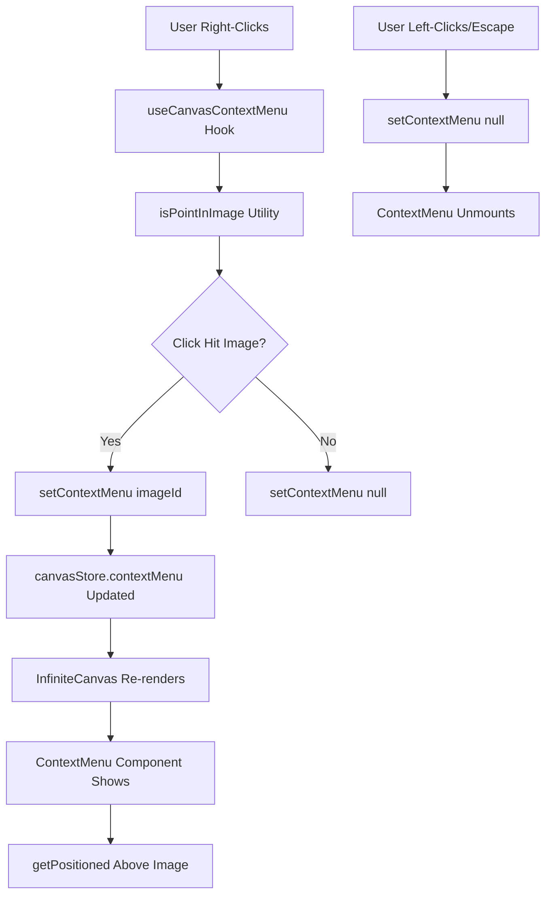
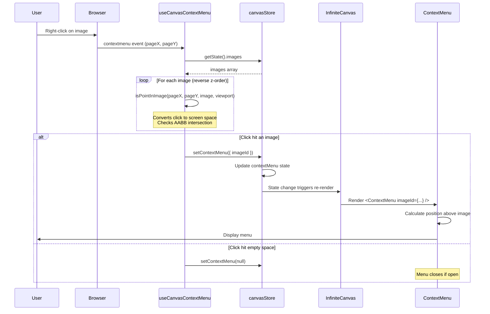
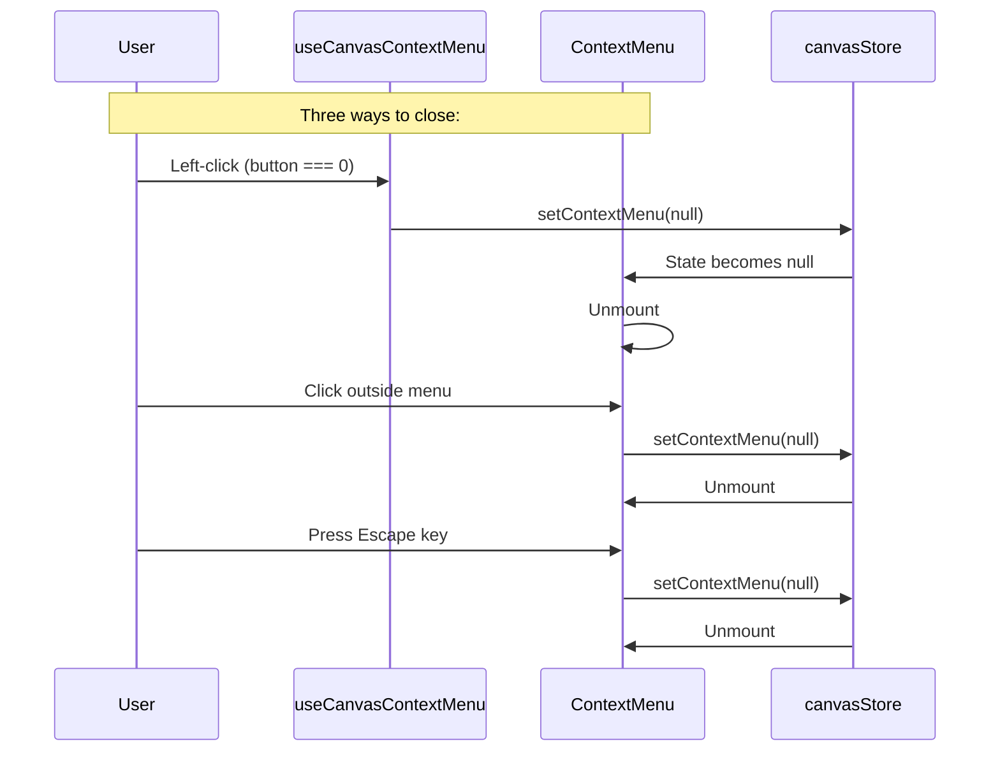

# Context Menu Feature

## Overview

The context menu feature provides a right-click menu for images on the infinite canvas. When a user right-clicks on an image, a contextual menu appears above the image with options like "Download" and "Variations".

## Architecture

### Components

| File | Responsibility |
|------|----------------|
| `src/components/ContextMenu.tsx` | The menu UI component |
| `src/hooks/useCanvasContextMenu.ts` | Hook that handles right-click detection and menu triggering |
| `src/store/canvasStore.ts` | Zustand store that tracks which image has the active menu |
| `src/utils/hitTest.ts` | Hit testing to detect which image was clicked |
| `src/utils/geometry.ts` | Screen-space positioning calculations |

### Data Flow



### Sequence Diagram: Opening the Context Menu



### Sequence Diagram: Closing the Context Menu



## Key Implementation Details

### 1. Hit Testing (Z-Order Aware)

The context menu respects the z-order of images. When multiple images overlap, the topmost image (last in the array) receives the context menu.

```typescript
// Iterate in reverse for proper z-order
for (let i = images.length - 1; i >= 0; i--) {
  if (isPointInImage(e.pageX, e.pageY, images[i], viewport)) {
    clickedImageId = images[i].id;
    break;
  }
}
```

### 2. Screen-Space Positioning

The menu must appear above the image in screen coordinates. This requires:

1. Convert image world coordinates → screen coordinates using viewport
2. Center menu horizontally above the image
3. Keep menu within viewport bounds

```typescript
const imageBox = getImageScreenBox(image, viewport);
menuX = imageBox.x + imageBox.width / 2 - menuWidth / 2;
menuY = imageBox.y - menuHeight - offsetAbove;

// Clamp to viewport
if (menuX < 8) menuX = 8;
if (menuY < 8) menuY = imageBox.y + imageBox.height + offsetAbove;
```

### 3. Viewport Transformation

World coordinates (canvas space) are converted to screen coordinates (pixel space):

```typescript
// toScreenX and toScreenY apply scale and offset
screenX = (worldX + viewport.offsetX) * viewport.scale
screenY = (worldY + viewport.offsetY) * viewport.scale
```

This accounts for:
- **Pan**: `offsetX`, `offsetY` shift the origin
- **Zoom**: `scale` stretches/shrinks everything

## How Does the UI Appear on Top of the Canvas?

This is the key question. The canvas uses **HTML/CSS stacking context**, not canvas drawing.

### The Rendering Stack

```mermaid
graph TB
    subgraph "Z-Index Layers"
        A[Canvas Element<br/>z-index: 0] --> "Images drawn via canvas API"
        B[ContextMenu<br/>z-index: 101] --> "HTML div rendered by React"
    end

    style A fill:#e1f5fe
    style B fill:#fff3e0
```

### Why This Works

1. **Canvas = Background Layer**: The `<canvas>` element has default stacking. All images are drawn onto this single canvas element using the Canvas 2D API (`ctx.drawImage()`).

2. **ContextMenu = Overlay Layer**: The `ContextMenu` is a React component that renders a standard HTML `<div>` with `position: fixed` and `z-index: 101`.

3. **CSS Stacking Context**: Browsers render elements with higher `z-index` on top of elements with lower `z-index`. Since `101 > 0`, the menu appears above the canvas.

4. **Portals Not Needed**: The menu is rendered directly within `InfiniteCanvas`'s JSX:
   ```tsx
   <div>
     <canvas ref={canvasRef} />
     {contextMenu && <ContextMenu ... />}
   </div>
   ```

### CSS Classes Used

```tsx
// The menu uses fixed positioning and high z-index
className="fixed z-[101] bg-white rounded-lg shadow-[0_4px_16px_rgba(0,0,0,0.12)] border border-slate-200/50"
```

| CSS Property | Purpose |
|--------------|---------|
| `position: fixed` | Position relative to viewport, not containing block |
| `z-index: 101` | Render above canvas (z-index 0) and other UI |
| `shadow-[...]` | Drop shadow for depth/elevation |
| `rounded-lg` | Rounded corners for modern look |

### Comparison: Canvas vs HTML Overlay

| Aspect | Canvas Images | Context Menu |
|--------|---------------|--------------|
| Rendering | `ctx.drawImage()` | React JSX → DOM |
| Positioning | World coordinates → transformed | Direct `style={{ left, top }}` |
| Interactivity | Hit testing in event handlers | Native click handlers |
| Stacking | Single layer (draw order) | CSS z-index layering |

## Store State Shape

```typescript
interface CanvasState {
  contextMenu: { imageId: string } | null;
}

interface CanvasActions {
  setContextMenu: (menu: { imageId: string } | null) => void;
}
```

The store tracks:
- **Which image** has the menu (by ID)
- **No position data** (calculated on render from image + viewport)

## Future Enhancements

Currently marked as TODO:
- **Download**: Implement actual file download
- **Variations**: Trigger AI image generation based on selected image
