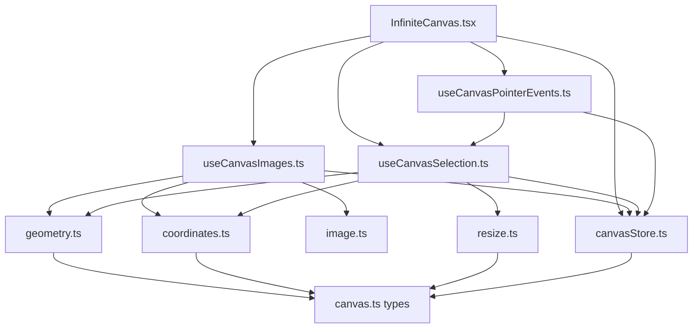
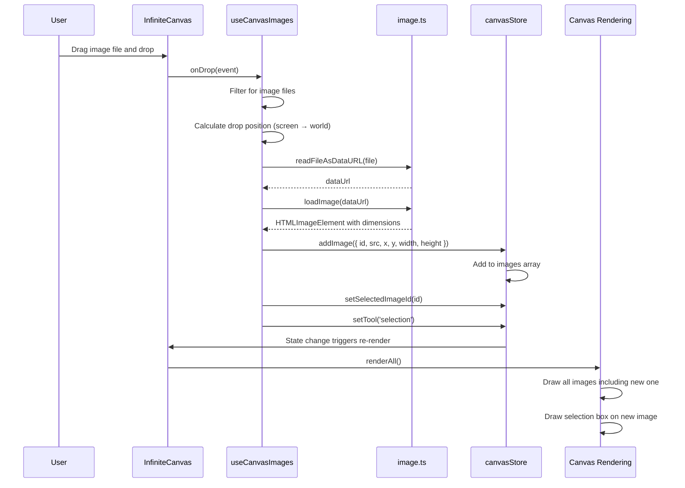
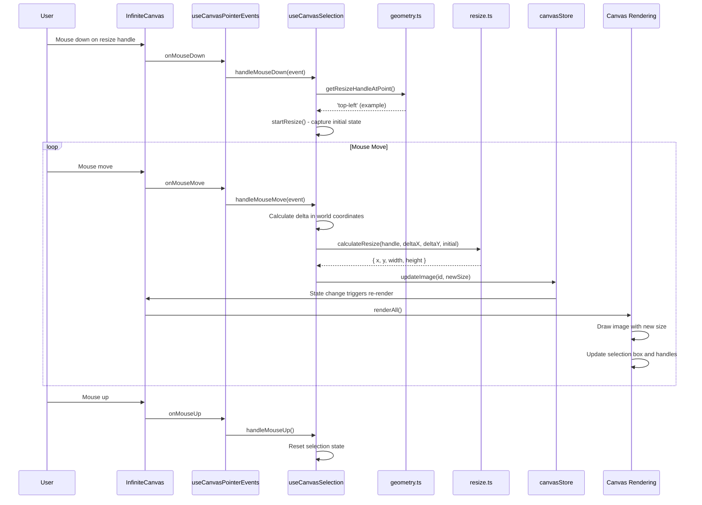
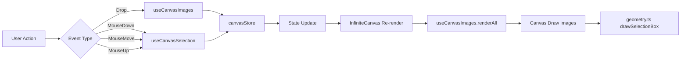
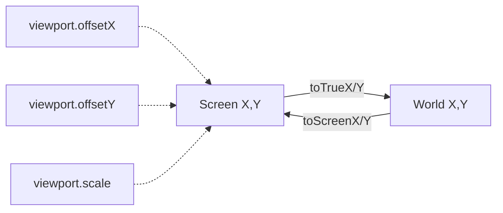

# Image Drag & Resize Architecture Documentation

## Context

This document describes how images are added to the infinite canvas, how they can be dragged and resized, and the data flow throughout the system. This feature allows users to drag and drop image files onto the canvas, select them, move them around, and resize them using corner handles.

## Main Files Overview

```
src/
├── components/
│   └── InfiniteCanvas.tsx        # Main canvas component - orchestrates all hooks
├── hooks/
│   ├── useCanvasImages.ts        # Image rendering & drag-drop handlers
│   ├── useCanvasSelection.ts     # Selection, dragging, resizing logic
│   └── useCanvasPointerEvents.ts # Event routing based on current tool
├── store/
│   └── canvasStore.ts            # Zustand store for global state
├── types/
│   └── canvas.ts                 # TypeScript interfaces
└── utils/
    ├── coordinates.ts            # World ↔ Screen coordinate conversion
    ├── geometry.ts               # Hit detection & selection box rendering
    ├── image.ts                  # Image loading & file reading
    └── resize.ts                 # Resize calculations with aspect ratio
```

### File Responsibilities

| File | Responsibility |
|------|----------------|
| `InfiniteCanvas.tsx` | Composes hooks, manages canvas element, triggers re-renders |
| `useCanvasImages.ts` | Renders images, handles drag-drop, converts files to data URLs |
| `useCanvasSelection.ts` | Manages selection state, handles mouse events for drag/resize |
| `useCanvasPointerEvents.ts` | Routes events to appropriate handlers based on current tool |
| `canvasStore.ts` | Centralized state (images, viewport, selection, tool) |
| `coordinates.ts` | Converts between world coordinates and screen coordinates |
| `geometry.ts` | Hit testing, selection box drawing, resize handle positioning |
| `image.ts` | Loads images with caching, reads files as data URLs |
| `resize.ts` | Calculates new dimensions maintaining aspect ratio |

---

## Data Flow Diagrams

### File Dependency Graph



### Adding Images - Sequence Diagram



### Resizing Images - Sequence Diagram



### Data Flow - State Updates



---

## Coordinate System

The canvas uses a dual coordinate system:

- **Screen Coordinates**: Pixel positions on the visible canvas (affected by pan/zoom)
- **World Coordinates**: Logical positions in the infinite canvas space

### Coordinate Transformation



**Formulas:**
- `screenX = (worldX + viewport.offsetX) * viewport.scale`
- `screenY = (worldY + viewport.offsetY) * viewport.scale`
- `worldX = (screenX / viewport.scale) - viewport.offsetX`
- `worldY = (screenY / viewport.scale) - viewport.offsetY`

---

## Key Data Structures

### ImageElement
```typescript
interface ImageElement {
  id: string;           // Unique identifier (crypto.randomUUID())
  type: 'image';       // Type discriminator
  src: string;         // Data URL of the image
  x: number;           // World position X
  y: number;           // World position Y
  width: number;       // Width in world units
  height: number;      // Height in world units
}
```

### Viewport
```typescript
interface Viewport {
  offsetX: number;     // Pan offset X in world coordinates
  offsetY: number;     // Pan offset Y in world coordinates
  scale: number;       // Zoom factor (1 = 100%)
}
```

### SelectionState (Internal to useCanvasSelection)
```typescript
interface SelectionState {
  activeHandle: ResizeHandle | null;     // Which handle is being dragged
  isDraggingImage: boolean;              // Is image being moved?
  dragStartX: number;                    // Mouse X when drag started
  dragStartY: number;                    // Mouse Y when drag started
  initialImageX: number;                 // Image X when drag started
  initialImageY: number;                 // Image Y when drag started
  initialImageWidth: number;             // Width when resize started
  initialImageHeight: number;            // Height when resize started
}
```

---

## How It Works - Plain English

### Adding an Image

1. **User drops a file** on the canvas
2. The `handleDrop` function in `useCanvasImages.ts`:
   - Checks if the dropped file is an image
   - Calculates where the mouse is in world coordinates (accounting for pan/zoom)
   - Reads the file as a data URL (base64 encoded image)
   - Loads the image to get its natural dimensions
3. A new `ImageElement` is created with:
   - A unique ID
   - The image data URL
   - The drop position (as x, y)
   - The image's natural dimensions (as width, height)
4. The image is added to the store via `addImage()`
5. The new image is automatically selected
6. The canvas re-renders, drawing the new image and its selection box

### Selecting an Image

1. **User clicks on the canvas**
2. `handleMouseDown` in `useCanvasSelection.ts`:
   - First checks if the click is on a resize handle (if an image is already selected)
   - Then checks if the click is inside any image (from top to bottom for z-index)
   - If nothing is clicked, deselects the current image
3. The selected image ID is stored in `canvasStore.selectedImageId`
4. The selection box (blue border with corner handles) is drawn around the selected image

### Dragging an Image

1. **User clicks on an image** (not on a resize handle)
2. `startDragImage()` captures:
   - The mouse starting position
   - The image's initial position
3. **While moving the mouse**:
   - The delta (movement) is calculated in screen coordinates
   - Delta is converted to world coordinates (dividing by scale)
   - Image's new position = initial position + delta
   - `updateImage()` updates the image in the store
   - Canvas re-renders with image at new position

### Resizing an Image

1. **User clicks on a corner handle** (top-left, top-right, bottom-left, bottom-right)
2. `startResize()` captures:
   - Which handle was clicked
   - Mouse starting position
   - Image's initial position and size
3. **While dragging**:
   - Mouse movement (deltaX, deltaY) is calculated
   - `calculateResize()` computes new dimensions:
     - Uses the larger of deltaX or deltaY to maintain aspect ratio
     - Applies sign based on which corner (left handles grow opposite to drag direction)
     - Calculates new width/height from aspect ratio
     - Adjusts x/y position so the opposite corner stays fixed
   - `updateImage()` updates the image in the store
   - Canvas re-renders with image at new size

### Aspect Ratio Preservation

The `calculateResize()` function in `resize.ts` ensures images keep their proportions:
- It calculates the "magnitude" as the maximum of absolute deltaX or deltaY
- This means dragging diagonally uses the same scaling for both dimensions
- The new height is derived from the new width using the original aspect ratio: `newHeight = newWidth / (originalWidth / originalHeight)`

---

## Verification

To verify the image functionality works:

1. **Add an image**: Drag and drop an image file onto the canvas
   - Expected: Image appears at drop location with selection box
2. **Drag an image**: Click and drag the image
   - Expected: Image moves smoothly following the mouse
3. **Resize an image**: Click and drag a corner handle
   - Expected: Image resizes maintaining aspect ratio
4. **Pan/zoom**: Use space+drag to pan, scroll to zoom
   - Expected: Images scale and move correctly with viewport
5. **Select/deselect**: Click image to select, click empty space to deselect
   - Expected: Selection box appears/disappears appropriately
