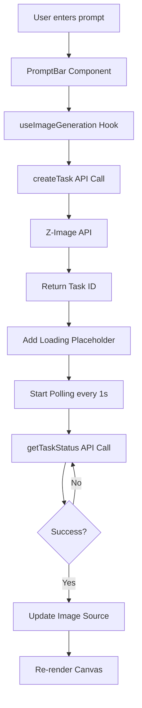
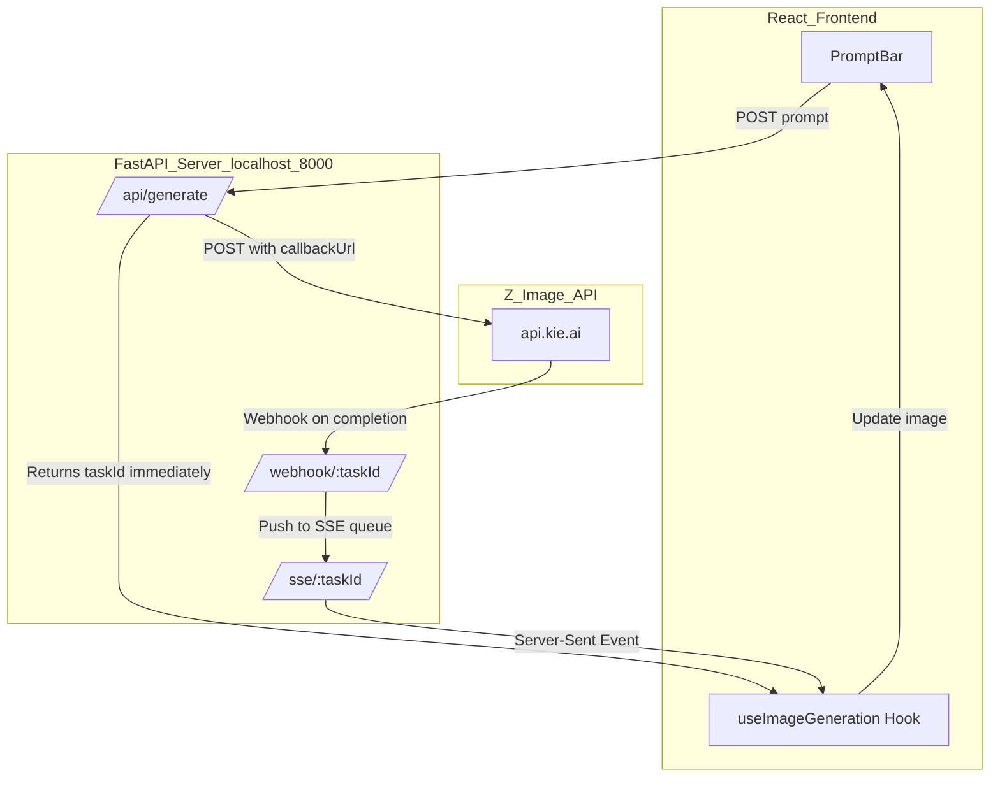

# Webhook Refactoring Proposal

## Overview

This document proposes refactoring the current polling-based API integration to use webhooks with a FastAPI backend server. This change would enable parallel image generation, reduce API overhead, and simplify the frontend codebase.

## Current Architecture (Polling-Based)

### Data Flow



### Current Limitations

| Issue | Impact |
|-------|--------|
| **Single `isGenerating` flag** | Blocks parallel requests - only one generation at a time |
| **Polling overhead** | 1 API request per second per task |
| **Manual cleanup** | Uses `window._stopPolling` hack to clean up intervals |
| **No task registry** | Can't track multiple concurrent generations |
| **Polling delay** | Up to 1 second delay before detecting completion |

### Code Complexity

- `src/services/pollingService.ts` (35 lines) - Generic polling utility
- `src/hooks/useImageGeneration.ts` (90 lines) - Orchestrates polling flow
- `src/components/PromptBar.tsx` - `isGenerating` state blocking submissions

## Proposed Architecture (Webhook-Based)

### Data Flow



### Z-Image Webhook Specification

From the [Z-Image API documentation](https://docs.kie.ai/market/z-image/z-image):

**Request with webhook:**
```json
POST /api/v1/jobs/createTask
{
  "model": "z-image",
  "callBackUrl": "https://your-domain.com/api/webhook/{taskId}",
  "input": {
    "prompt": "a beautiful sunset",
    "aspect_ratio": "1:1",
    "nsfw_checker": true
  }
}
```

**Webhook callback payload:**
```json
POST {callBackUrl}
{
  "taskId": "task_z-image_12345",
  "state": "success",
  "resultJson": "{\"resultUrls\": [\"https://...\"]}"
}
```

## Implementation Plan

### Phase 1: FastAPI Server

Create a new FastAPI service that acts as a middleware between the React frontend and Z-Image API.

**File Structure:**
```
server/
├── main.py              # FastAPI app entry point
├── routers/
│   ├── generate.py      # /api/generate endpoint
│   └── webhook.py       # /webhook/:taskId endpoint
├── services/
│   ├── z_image.py       # Z-Image API client
│   └── sse.py           # SSE connection management
└── requirements.txt
```

**Core Implementation (`server/main.py`):**
```python
from fastapi import FastAPI
from fastapi.middleware.cors import CORSMiddleware
from routers import generate, webhook

app = FastAPI(title="Infinite Canvas Image Generation API")

app.add_middleware(
    CORSMiddleware,
    allow_origins=["http://localhost:5173"],
    allow_methods=["*"],
    allow_headers=["*"],
)

app.include_router(generate.router, prefix="/api", tags=["generate"])
app.include_router(webhook.router, prefix="/webhook", tags=["webhook"])

@app.get("/health")
async def health():
    return {"status": "ok"}
```

**Generate Endpoint (`server/routers/generate.py`):**
```python
from fastapi import APIRouter, BackgroundTasks, HTTPException
from pydantic import BaseModel
import uuid
from services.sse import sse_manager
from services.z_image import create_z_image_task

router = APIRouter()

class GenerateRequest(BaseModel):
    prompt: str
    aspect_ratio: str = "1:1"

@router.post("/generate")
async def generate_image(req: GenerateRequest):
    task_id = str(uuid.uuid4())

    # Create SSE connection for this task
    await sse_manager.create_connection(task_id)

    # Call Z-Image API with our webhook URL
    webhook_url = f"{SERVER_URL}/webhook/{task_id}"
    z_task_id = await create_z_image_task(
        prompt=req.prompt,
        aspect_ratio=req.aspect_ratio,
        callback_url=webhook_url
    )

    return {
        "taskId": task_id,
        "sseUrl": f"/sse/{task_id}",
        "zTaskId": z_task_id
    }
```

**Webhook Handler (`server/routers/webhook.py`):**
```python
from fastapi import APIRouter, Request
from services.sse import sse_manager

router = APIRouter()

@router.post("/{task_id}")
async def webhook_callback(task_id: str, request: Request):
    payload = await request.json()

    # Forward the webhook data to the SSE connection
    await sse_manager.send_event(task_id, payload)

    return {"status": "received"}
```

**SSE Manager (`server/services/sse.py`):**
```python
from fastapi import APIRouter
from sse_starlette.sse import EventSourceResponse
import asyncio
import json

class SSEManager:
    def __init__(self):
        self.connections: dict[str, asyncio.Queue] = {}

    async def create_connection(self, task_id: str):
        self.connections[task_id] = asyncio.Queue()

    async def send_event(self, task_id: str, data: dict):
        if task_id in self.connections:
            await self.connections[task_id].put(data)

    async def event_stream(self, task_id: str):
        try:
            while True:
                data = await self.connections[task_id].get()
                yield {"data": json.dumps(data)}
                if data.get("state") in ["success", "failed"]:
                    break
        finally:
            self.connections.pop(task_id, None)

sse_manager = SSEManager()

sse_router = APIRouter()

@sse_router.get("/{task_id}")
async def sse_endpoint(task_id: str):
    return EventSourceResponse(
        sse_manager.event_stream(task_id),
        media_type="text/event-stream"
    )
```

### Phase 2: Frontend Refactoring

**Generate Types from OpenAPI:**
```bash
# Install dependency
npm install -D openapi-typescript

# Generate types from FastAPI's OpenAPI schema
npx openapi-typescript http://localhost:8000/openapi.json -o src/types/fastapi.ts
```

**Updated `src/hooks/useImageGeneration.ts`:**
```typescript
import { useCanvasStore } from '../store/canvasStore';
import { calculateViewportCenter } from '../utils/viewport';
import { generateImageId } from '../utils/id';
import { loadImage } from '../utils/image';
import { DEFAULT_IMAGE_SIZE } from '../constants/imageGeneration';
import type { ImageSource } from '../types/canvas';

interface GenerateRequest {
  prompt: string;
  aspect_ratio?: string;
}

interface GenerateResponse {
  taskId: string;
  sseUrl: string;
  zTaskId: string;
}

interface WebhookEvent {
  taskId: string;
  state: 'waiting' | 'queuing' | 'generating' | 'success' | 'fail';
  resultJson?: string;
}

// Track active SSE connections for cleanup
const activeConnections = new Map<string, EventSource>();

export function useImageGeneration() {
  const { addImage, updateImage, viewport } = useCanvasStore();

  const generateImage = async (
    prompt: string,
    aspectRatio: string = '1:1'
  ): Promise<string | null> => {
    try {
      // 1. Call local FastAPI server - returns immediately
      const response = await fetch('http://localhost:8000/api/generate', {
        method: 'POST',
        headers: { 'Content-Type': 'application/json' },
        body: JSON.stringify({
          prompt,
          aspect_ratio: aspectRatio
        } satisfies GenerateRequest)
      });

      if (!response.ok) {
        throw new Error(`API error: ${response.status}`);
      }

      const { taskId, sseUrl } = await response.json() as GenerateResponse;

      // 2. Create image placeholder
      const imageId = generateImageId();
      const position = calculateViewportCenter(viewport, DEFAULT_IMAGE_SIZE);

      const source: ImageSource = {
        type: 'generated',
        prompt,
      };

      addImage({
        id: imageId,
        type: 'image',
        src: '',
        x: position.x,
        y: position.y,
        width: DEFAULT_IMAGE_SIZE,
        height: DEFAULT_IMAGE_SIZE,
        isLoading: true,
        loadingState: 'creating',
        source,
      });

      // 3. Listen for webhook via SSE
      const eventSource = new EventSource(`http://localhost:8000${sseUrl}`);
      activeConnections.set(imageId, eventSource);

      eventSource.onmessage = async (e) => {
        const event = JSON.parse(e.data) as WebhookEvent;

        switch (event.state) {
          case 'waiting':
          case 'queuing':
            updateImage(imageId, { loadingState: 'creating' });
            break;

          case 'generating':
            updateImage(imageId, { loadingState: 'polling' });
            break;

          case 'success':
            if (event.resultJson) {
              const result = JSON.parse(event.resultJson);
              const imageUrl = result.resultUrls[0];

              // Preload before showing
              updateImage(imageId, {
                src: imageUrl,
                loadingState: 'downloading'
              });

              try {
                await loadImage(imageUrl);
                updateImage(imageId, {
                  isLoading: false,
                  loadingState: 'success'
                });
              } catch {
                updateImage(imageId, {
                  isLoading: false,
                  loadingState: 'failed'
                });
              }
            }
            eventSource.close();
            activeConnections.delete(imageId);
            break;

          case 'fail':
            updateImage(imageId, {
              isLoading: false,
              loadingState: 'failed'
            });
            eventSource.close();
            activeConnections.delete(imageId);
            break;
        }
      };

      eventSource.onerror = () => {
        updateImage(imageId, {
          isLoading: false,
          loadingState: 'failed'
        });
        eventSource.close();
        activeConnections.delete(imageId);
      };

      return imageId;
    } catch (error) {
      console.error('Failed to generate image:', error);
      return null;
    }
  };

  // Cleanup function for component unmount
  const cleanup = (imageId: string) => {
    const eventSource = activeConnections.get(imageId);
    if (eventSource) {
      eventSource.close();
      activeConnections.delete(imageId);
    }
  };

  return { generateImage, cleanup };
}
```

**Updated `src/components/PromptBar.tsx` - Remove blocking:**
```typescript
// REMOVE: const [isGenerating, setIsGenerating] = useState(false);

// BEFORE (blocked parallel):
const canGenerate = prompt.trim() && !isGenerating && selectedModels.includes(MODEL_Z_IMAGE);

const handleSubmit = async () => {
  setIsGenerating(true);
  try {
    await generateImage(prompt);
    setPrompt("");
  } finally {
    setIsGenerating(false);
  }
};

// AFTER (parallel enabled):
const canGenerate = prompt.trim() && selectedModels.includes(MODEL_Z_IMAGE);

const handleSubmit = async () => {
  // Each request is independent - no blocking
  const imageId = await generateImage(prompt);
  if (imageId) {
    setPrompt(""); // Only clear if successful
  }
};
```

### Phase 3: Cleanup

**Files to Delete:**
- `src/services/pollingService.ts` - No longer needed
- `src/services/zImageApi.ts` - Moved to FastAPI server

**Files to Simplify:**
- `src/hooks/useImageGeneration.ts` - No polling logic
- `src/components/PromptBar.tsx` - Remove `isGenerating` state
- `docs/api-integration.md` - Update documentation

**Update Documentation:**
- Update architecture diagrams
- Document SSE endpoints
- Add FastAPI setup instructions

## Benefits Comparison

| Aspect | Current (Polling) | Proposed (Webhooks) |
|--------|-------------------|---------------------|
| **Parallel requests** | ❌ Blocked by `isGenerating` flag | ✅ Naturally supported |
| **API calls per task** | ~30-60 calls (1/sec for 30-60s) | 2 calls (create + webhook) |
| **Real-time updates** | ⚠️ Up to 1s polling delay | ✅ Immediate push via SSE |
| **Server-side queue** | ❌ None | ✅ Can implement in FastAPI |
| **Type safety** | ⚠️ Manual types | ✅ Auto-generated from OpenAPI |
| **Frontend complexity** | ⚠️ Polling service + cleanup | ✅ Simple SSE listener |
| **Error handling** | ⚠️ Silent failures | ✅ SSE error events |
| **Rate limiting** | ❌ Not possible | ✅ Can add in FastAPI |
| **Scalability** | ❌ Limited by polling | ✅ Event-driven architecture |

## Deployment Considerations

### Development
```bash
# Terminal 1: FastAPI server
cd server
uvicorn main:app --reload --port 8000

# Terminal 2: React dev server
npm run dev
```

### Production
- Deploy FastAPI to a hosting service (Railway, Render, Fly.io)
- Update `SERVER_URL` in production to point to deployed backend
- Add authentication/authorization for webhook endpoints
- Implement webhook signature verification (see [Z-Image webhook verification guide](https://docs.kie.ai/common-api/webhook-verification))

### Environment Variables
```bash
# FastAPI .env
KIE_AI_API_KEY=your_api_key_here
SERVER_URL=https://your-deployed-backend.com
CORS_ORIGINS=https://your-frontend.com

# React .env
VITE_FASTAPI_URL=https://your-deployed-backend.com
```

## Migration Steps

1. **Phase 1**: Set up FastAPI server locally
   - Create `server/` directory
   - Implement generate, webhook, and SSE endpoints
   - Test with Postman/curl

2. **Phase 2**: Update frontend to use FastAPI
   - Generate types from OpenAPI
   - Refactor `useImageGeneration` hook
   - Remove `isGenerating` from `PromptBar`

3. **Phase 3**: Cleanup and documentation
   - Delete unused files
   - Update API integration documentation
   - Add deployment guide

4. **Phase 4**: Testing
   - Test parallel generation (submit multiple prompts quickly)
   - Test error handling
   - Test SSE reconnection logic

## Potential Issues & Solutions

| Issue | Solution |
|-------|----------|
| **SSE connection drops** | Implement reconnection logic with exponential backoff |
| **Webhook not received** | Add timeout fallback to polling for missed webhooks |
| **CORS issues** | Configure CORS middleware in FastAPI |
| **Port conflicts** | Make FastAPI port configurable via .env |
| **Type generation** | Add npm script to regenerate types on dev server start |

## References

- [Z-Image API Documentation](https://docs.kie.ai/market/z-image/z-image)
- [Webhook Verification Guide](https://docs.kie.ai/common-api/webhook-verification)
- [Server-Sent Events (MDN)](https://developer.mozilla.org/en-US/docs/Web/API/Server-sent_events)
- [FastAPI Documentation](https://fastapi.tiangolo.com/)
- [openapi-typescript](https://openapi-ts.pages.dev/)
