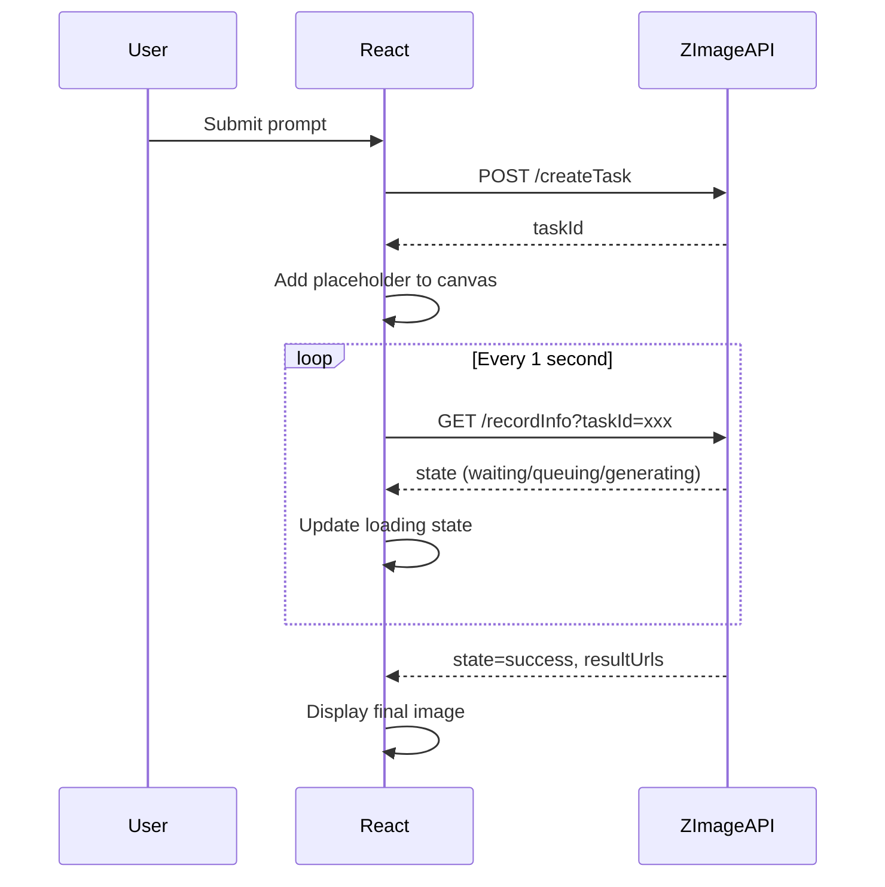
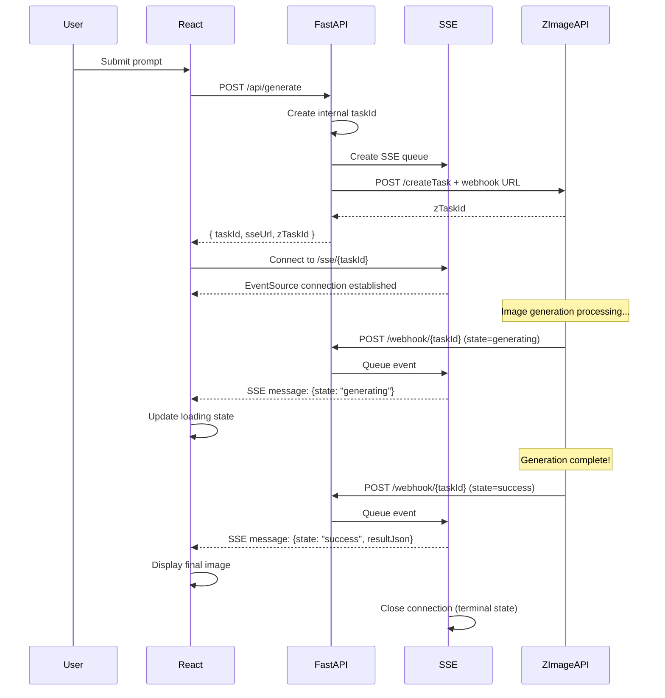
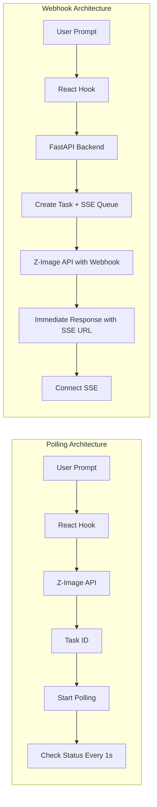
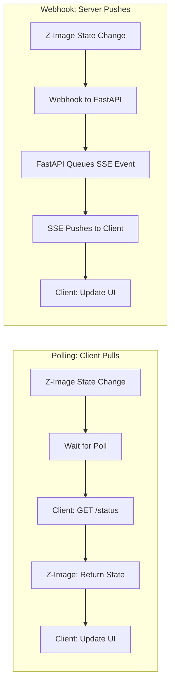

# Webhook Architecture Refactoring: Documentation & Analysis

## Executive Summary

This document describes the architectural migration from a **client-side polling pattern** to a **webhook-based SSE architecture** for image generation in the Infinite Canvas Whiteboard application.

**Key Changes:**
- Removed `pollingService.ts` and `zImageApi.ts` (client-side polling)
- Added FastAPI backend with webhook support
- Implemented Server-Sent Events (SSE) for real-time updates
- Auto-generated TypeScript types from OpenAPI schema

---

## 1. Old Architecture: Polling Pattern

### 1.1 How It Worked

The old architecture used client-side polling where the React frontend continuously checked the status of image generation tasks.



### 1.2 Component Responsibilities

| File | Responsibility |
|------|-----------------|
| `src/services/pollingService.ts` | Generic polling utility with `setInterval()` |
| `src/services/zImageApi.ts` | Direct Z-Image API calls (createTask, getTaskStatus) |
| `src/hooks/useImageGeneration.ts` | Orchestrated polling flow and state updates |
| `src/types/zImage.ts` | Type definitions for Z-Image API |

### 1.3 Problems with Polling

1. **Single Generation Blocking** - Only one image at a time
2. **High API Overhead** - 30-60 calls per task (1 per second)
3. **Delayed Updates** - Up to 1 second delay before detecting completion
4. **Poor Cleanup** - Used temporary hacks like `window._stopPolling`

---

## 2. New Architecture: Webhook + SSE

### 2.1 How It Works

The new architecture uses webhooks and Server-Sent Events for real-time communication.



### 2.2 Server-Side Components

#### File: `server/main.py`
FastAPI application entry point that registers routers and CORS middleware.

**What Changed:**
- Added new FastAPI application
- Configured CORS for development
- Registered three router modules

#### File: `server/routers/generate.py`
Handles image generation initiation.

**What Changed:**
- Creates internal task ID (UUID)
- Establishes SSE connection before calling Z-Image
- Constructs webhook URL for this specific task
- Returns immediately with SSE URL for client connection

#### File: `server/routers/webhook.py`
Receives callbacks from Z-Image API.

**What Changed:**
- Listens for POST requests on `/webhook/{task_id}`
- Forwards payloads to SSE manager
- Returns 200 immediately to prevent Z-Image retries

#### File: `server/routers/sse.py`
Server-Sent Events endpoint for streaming.

**What Changed:**
- Provides `EventSourceResponse` for real-time communication
- Delegates to SSE manager for event streaming
- Uses `sse-starlette` for SSE support

#### File: `server/services/sse_manager.py`
Manages SSE connection lifecycle.

**What Changed:**
- Maintains queue per task (using `asyncio.Queue`)
- Implements event streaming generator
- Auto-closes connections on terminal states
- Cleans up resources on disconnect

#### File: `server/services/z_image.py`
Z-Image API integration layer.

**What Changed:**
- Moved from frontend (`zImageApi.ts`) to backend
- Uses `httpx` for async HTTP calls
- Includes webhook URL in task creation

### 2.3 Client-Side Components

#### File: `src/services/sseConnectionManager.ts`
**NEW FILE** - Manages EventSource connections.

**Responsibilities:**
- Singleton pattern for managing all SSE connections
- Maps `imageId` to EventSource connections
- Implements reconnection logic (max 3 attempts)
- Parses FastAPI's `data` wrapper pattern
- Provides cleanup methods

**Key Methods:**
```typescript
connect(imageId, sseUrl, callbacks) // Create new SSE connection
disconnect(imageId)                  // Close specific connection
disconnectAll()                      // Close all connections
getActiveCount()                     // Get active connection count
```

#### File: `src/hooks/useImageGeneration.ts`
**MODIFIED** - Now uses webhook pattern.

**What Changed:**
- Removed polling interval logic
- Added SSE connection via `sseManager.connect()`
- Returns immediately after calling `/api/generate`
- Listens for SSE events instead of polling

**New Flow:**
1. Call FastAPI `/api/generate` → get `taskId` and `sseUrl`
2. Add placeholder image to canvas
3. Connect to SSE endpoint with callbacks
4. React to state changes via SSE messages

#### File: `src/types/fastapi.ts`
**NEW FILE** - Auto-generated TypeScript types.

**Responsibilities:**
- Generated from FastAPI's OpenAPI schema
- Provides type safety for API requests/responses
- Single source of truth for API contracts

**Key Types:**
```typescript
GenerateRequest  // { prompt, aspect_ratio, nsfw_checker }
GenerateResponse // { taskId, sseUrl, zTaskId }
WebhookEvent     // { internalTaskId, taskId, state, resultJson }
```

#### File: `src/config/api.ts`
**MODIFIED** - Added FastAPI URL configuration.

**What Changed:**
- Added `VITE_FASTAPI_URL` environment variable
- Default fallback to `http://localhost:8000`

---

## 3. Data Flow Comparison

### 3.1 Request Flow



### 3.2 State Update Flow



---

## 4. Answering Your Questions

### Q1: Is it easier to add parallel image generation in modals?

**Answer: YES - Much easier with the new architecture.**

**Why:**
1. **No Blocking** - The old `isGenerating` flag that blocked submissions is no longer needed
2. **Multiple SSE Connections** - `sseConnectionManager` supports concurrent connections
3. **Immediate Response** - Each generation returns immediately with its own SSE URL
4. **Independent Tracking** - Each image has its own `imageId` → SSE connection mapping

**What's Missing:**
The modal's "Generate" button has no `onClick` handler. To implement parallel generation:

```typescript
// In BaseVariationsModal footer button:
onClick={async () => {
  for (const prompt of prompts) {
    for (const model of prompt.models) {
      await generateImage(prompt.text, aspectRatio, model);
    }
  }
  onClose();
}}
```

**Complexity: Low** - The infrastructure is ready, just need to call `generateImage()` in a loop.

---

### Q2: How hard is it to add more providers? Is TypeScript codegen useful?

**Answer: VERY EASY - TypeScript codegen is a huge advantage.**

**Why TypeScript Codegen Helps:**
1. **Single Source of Truth** - FastAPI schema generates frontend types automatically
2. **Type Safety** - Compile-time checking of request/response structures
3. **Auto-Completion** - IDE knows all available fields and types
4. **Easy Refactoring** - Change FastAPI schema → regenerate types → see TypeScript errors

**How to Add a Provider (e.g., OpenAI DALL-E):**

**Backend:**
```python
# server/services/openai_image.py
async def create_openai_task(prompt: str, callback_url: str) -> str:
    # Call OpenAI API
    pass

# server/routers/generate.py
if provider == "openai":
    task_id = await create_openai_task(prompt, webhook_url)
```

**Frontend:**
```bash
# Regenerate types after schema change
npm run generate:api-types
```

The frontend types automatically update! No manual type definitions needed.

**Complexity: Low** - The codegen setup makes adding providers straightforward.

---

### Q3: Are there duplications that could be improved?

**Answer: MINOR - Code is reasonably modular.**

**Observations:**

1. **State Management Pattern** - The SSE event handling in `useImageGeneration` could be extracted:
   ```typescript
   // Could create: src/hooks/useSseStateUpdates.ts
   function useSseStateUpdates(imageId: string, sseUrl: string) {
     // Move the switch/case logic here
   }
   ```

2. **Error Handling** - Similar try/catch patterns in multiple files could be unified.

3. **URL Construction** - `sseUrl` construction happens in both backend and frontend.

**Recommendations:**
- **Low Priority** - Current code is readable and maintainable
- **Consider extracting** SSE event parsing if more providers are added
- **Add unit tests** for SSE manager before refactoring

---

### Q4: How hard to implement the Gemini prompt generation in modals?

**Answer: EASY - The Gemini API is working, just needs to be wired to image generation.**

**Current State:**
- `geminiApi.ts` works correctly
- `BaseVariationsModal` successfully generates prompt variations
- **The issue:** Modal's "Generate" button has no `onClick` handler

**What's Broken:**
The modal creates prompts but never calls `generateImage()` to create actual images.

**Fix Required:**

```typescript
// In BaseVariationsModal.tsx footer button:
<button
  onClick={async () => {
    for (const prompt of prompts) {
      for (const model of prompt.models) {
        // This call is missing!
        const id = await generateImage(prompt.text, '1:1', model);
        // Optional: track generation IDs
      }
    }
    onClose();
  }}
  disabled={totalImages === 0}
>
  Generate {totalImages} images
</button>
```

**Import Required:**
```typescript
import { useImageGeneration } from '../hooks/useImageGeneration';
```

**Complexity: Very Low** - Just need to add the click handler and wire up the hook.

---

## 5. Migration Summary

### Files Removed
| File | Reason |
|------|--------|
| `src/services/pollingService.ts` | Replaced by SSE |
| `src/services/zImageApi.ts` | Moved to FastAPI backend |

### Files Added
| File | Purpose |
|------|---------|
| `server/main.py` | FastAPI application |
| `server/config.py` | Configuration management |
| `server/routers/generate.py` | Image generation endpoint |
| `server/routers/webhook.py` | Webhook receiver |
| `server/routers/sse.py` | SSE streaming endpoint |
| `server/services/sse_manager.py` | SSE connection manager |
| `server/services/z_image.py` | Z-Image API client |
| `server/schemas/requests.py` | Request Pydantic models |
| `server/schemas/responses.py` | Response Pydantic models |
| `src/services/sseConnectionManager.ts` | SSE client manager |
| `src/types/fastapi.ts` | Auto-generated types |

### Files Modified
| File | Changes |
|------|---------|
| `src/hooks/useImageGeneration.ts` | Replaced polling with SSE pattern |
| `src/config/api.ts` | Added FastAPI URL configuration |
| `package.json` | Added `generate:api-types` script |

---

## 6. Python Code Fixes Required

### 6.1 Identified Pylance Errors

After analyzing the Python code in the `server/` directory, the following issues were found:

#### Issue 1: Empty `__init__.py` Files (Low Severity)
**Location:** `server/routers/__init__.py`, `server/services/__init__.py`, `server/schemas/__init__.py`

**Problem:** Files are empty (only 1 line, no content). This causes Pylance warnings about missing module exports.

**Fix:** Add proper exports to make imports cleaner and type checking work better.

```python
# server/routers/__init__.py
from .generate import router as generate_router
from .webhook import router as webhook_router
from .sse import router as sse_router

__all__ = ["generate_router", "webhook_router", "sse_router"]
```

```python
# server/services/__init__.py
from .sse_manager import sse_manager
from .z_image import create_z_image_task

__all__ = ["sse_manager", "create_z_image_task"]
```

```python
# server/schemas/__init__.py
from .requests import GenerateRequest
from .responses import GenerateResponse, WebhookResponse

__all__ = ["GenerateRequest", "GenerateResponse", "WebhookResponse"]
```

#### Issue 2: Missing Type Annotations in `sse_manager.py`
**Location:** `server/services/sse_manager.py`

**Problem:** The `SSEManager` class methods lack return type annotations for the dictionary types.

**Fix:** Add proper type hints for better Pylance support.

```python
from typing import Dict, AsyncIterator

class SSEManager:
    def __init__(self) -> None:
        self.connections: Dict[str, asyncio.Queue] = {}
        self.clients: Dict[str, str] = {}

    async def create_connection(self, task_id: str) -> None:
        # Existing code
        pass

    async def send_event(self, task_id: str, data: dict) -> bool:
        # Existing code
        pass

    async def event_stream(self, task_id: str) -> AsyncIterator[dict]:
        # Existing code
        pass

    def get_connection_count(self) -> int:
        # Existing code
        pass
```

#### Issue 3: Missing Environment Variable Validation
**Location:** `server/config.py`

**Problem:** The `Settings` class doesn't validate that required environment variables are set before runtime.

**Fix:** Add validation to fail fast if API key is missing.

```python
from pydantic_settings import BaseSettings, SettingsConfigDict
from pydantic import Field

class Settings(BaseSettings):
    kie_ai_api_key: str = Field(..., description="KIE.AI API key is required")
    server_url: str = "http://localhost:8000"
    cors_origins: str = "http://localhost:5173"

    model_config = SettingsConfigDict(env_file=".env")

    @property
    def cors_origins_list(self) -> list[str]:
        return [origin.strip() for origin in self.cors_origins.split(",")]

settings = Settings()
```

### 6.2 Fix Summary

| File | Issue | Fix Type |
|------|-------|----------|
| `routers/__init__.py` | Empty file, no exports | Add exports |
| `services/__init__.py` | Empty file, no exports | Add exports |
| `schemas/__init__.py` | Empty file, no exports | Add exports |
| `services/sse_manager.py` | Missing type hints | Add return type annotations |
| `config.py` | No validation on required env vars | Add Field validation |

---

## 7. Benefits of New Architecture

1. **Parallel Generation** - Multiple images can generate simultaneously
2. **Reduced API Calls** - 2 calls per task vs 30-60 (polling)
3. **Real-Time Updates** - Instant notification via SSE
4. **Better Resource Management** - Proper cleanup and lifecycle management
5. **Type Safety** - Auto-generated TypeScript types from OpenAPI
6. **Scalability** - FastAPI handles concurrent requests efficiently
7. **Developer Experience** - Clear separation of concerns, easy to extend
